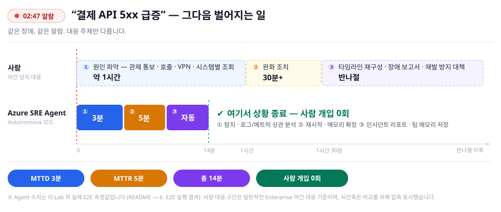
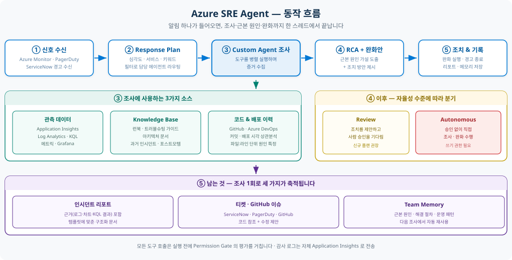

# Azure SRE Agent 개요

> **5분 브리핑용 문서입니다.** 각 항목의 상세 설명·화면·설정 방법은
> **[SRE Agent 기능 설명](SRE_Agent.md)** 에 있습니다.
>
> 포털 [sre.azure.com](https://sre.azure.com) · 공식 문서 [learn.microsoft.com/azure/sre-agent](https://learn.microsoft.com/azure/sre-agent/overview)

Azure SRE Agent 는 운영 인시던트를 **자동으로 조사하고**, 수집한 근거를 바탕으로
**근본 원인과 조치 방안을 제시하는** Azure 관리형 AI 에이전트입니다.

이 문서는 에이전트가 무엇을 하는지, 무엇으로 통제하는지, 그리고 **이 저장소에서 실제로 검증한 결과**를
순서대로 설명합니다. 제품의 표준 동작과 이 Lab 이 의도적으로 바꾼 설정은 구분해 표기합니다.

---

## 목차

1. [무엇이 달라지나요](#1-무엇이-달라지나요)
2. [인시던트가 발생하면 어떻게 조사하나요](#2-인시던트가-발생하면-어떻게-조사하나요)
3. [어떤 정보를 볼 수 있나요](#3-어떤-정보를-볼-수-있나요)
4. [과거 경험은 어떻게 쌓이나요](#4-과거-경험은-어떻게-쌓이나요)
5. [권한과 승인은 어떻게 통제하나요](#5-권한과-승인은-어떻게-통제하나요)
6. [우리 팀에 맞게 어떻게 확장하나요](#6-우리-팀에-맞게-어떻게-확장하나요)
7. [비용은 어떻게 발생하나요](#7-비용은-어떻게-발생하나요)
8. [실제로 되나요 — 검증 결과](#8-실제로-되나요--검증-결과)
9. [도입 전에 확인할 것](#9-도입-전에-확인할-것)

---

## 1. 무엇이 달라지나요

**새벽 2시 47분, 당직 폰이 울립니다. "결제 API 5xx 급증."**

- **원인 파악에만 1시간.** 관제 통보 → 담당자 호출 → VPN 접속 → 시스템별 로그인.
  조사를 시작하기도 전에 한 시간이 지나갑니다.
- **아는 사람이 없으면 원점.** 지난 분기 같은 장애의 원인과 조치는 개인 메모에만 남아 있습니다.
- **복구가 끝나도 반나절.** 타임라인 재구성, 장애 보고서, 재발 방지 대책, 경영층 보고.

  

| 기존 장애 대응 | Azure SRE Agent 를 활용한 대응 |
|---|---|
| 담당자가 경고를 확인한 뒤 조사를 시작합니다 | 대응 계획에 따라 **에이전트가 자동으로** 조사를 시작합니다 |
| 모니터링 화면 · 로그 · 변경 이력 · 소스 코드를 각각 확인합니다 | 필요한 자료를 **함께 조회해** 서로 연결합니다 |
| 담당자가 여러 가능성을 머릿속에서 비교합니다 | 가설을 세우고 **근거로 확인하거나 제외**합니다 |
| 조사 결과를 티켓과 메일로 다시 작성합니다 | 같은 결과를 **GitHub Issue · Teams · Outlook** 으로 전달합니다 |
| 해결 경험이 담당자 개인에게 남습니다 | 근본 원인과 해결 과정이 **팀 지식으로 축적**됩니다 |

에이전트는 오류 로그를 나열하지 않습니다. **영향 범위를 확인하고, 원격 분석·변경 이력·소스 코드를
함께 살펴본 뒤, 근본 원인과 다음 조치를 설명합니다.**

---

## 2. 인시던트가 발생하면 어떻게 조사하나요

  

| 단계 | 무슨 일이 일어나나 |
|:--:|---|
| 1 | **경고를 받습니다** — Azure Monitor · PagerDuty · ServiceNow |
| 2 | **조사 범위를 정합니다** — 대응 계획(Response Plan)이 담당 에이전트와 자율 수준을 결정 |
| 3 | **근거를 모읍니다** — 메트릭 · 로그 · 리소스 구성 · 배포 이력 · 소스 코드를 **병렬 조회** |
| 4 | **가설을 세우고 검증합니다** — 근거와 맞지 않는 원인을 제외 |
| 5 | **근본 원인과 조치를 제시합니다** — 최소 범위의 완화 방안을 근거와 함께 |
| 6 | **사람이 검토하거나, 자율 실행합니다** — 실행 모드에 따라 결정 |
| 7 | **결과를 공유하고 학습합니다** — 티켓·알림 생성, 팀 메모리 저장 |

→ 상세: [조사 흐름](SRE_Agent.md#1-인시던트가-발생하면-어떻게-조사하나요)

---

## 3. 어떤 정보를 볼 수 있나요

에이전트는 **관리 ID 와 Azure RBAC 권한**으로 리소스를 조사합니다.
Azure 내부 원격 분석은 **커넥터 없이도** 기본 도구로 조회됩니다.

| 분류 | 확인할 수 있는 정보 |
|---|---|
| 애플리케이션 상태 | Application Insights 요청 · 예외 · 종속성 호출 |
| 로그 | Log Analytics 작업 영역의 로그 (KQL) |
| 인프라 상태 | Azure Monitor 메트릭, 리소스 구성, Resource Graph |
| 변경 이력 | Azure Activity Log, 배포 이력, Container Apps 리비전 |
| 소스와 문서 | GitHub · Azure DevOps, 운영 절차서, 기술 문서 |
| 과거 경험 | 유사 인시던트, 이전의 근본 원인과 해결 방법 |

> 외부 시스템(Datadog · Splunk · Grafana 등)이나 특정 데이터 원본을 **반복해서** 쓴다면
> 커넥터를 추가해 탐색 단계를 줄이고 토큰 사용량을 낮출 수 있습니다.

---

## 4. 과거 경험은 어떻게 쌓이나요

조사가 끝나면 **증상 · 근본 원인 · 해결 단계 · 피해야 할 접근**이 추출되어 다음 조사에 쓰입니다.
업로드한 런북과 아키텍처 문서도 같은 지식 기반에서 함께 검색되며 **출처와 함께** 제시됩니다.

| 지식의 출처 | 예 |
|---|---|
| 업로드한 문서 | 런북, 아키텍처 안내서, 대기 근무 지침, SLO 기준 |
| 자동 축적 | 과거 인시던트의 원인 · 조치 · 교훈 |
| 외부 연결 | GitHub · Azure DevOps 위키, Microsoft Learn, 사용자 지정 MCP |

> **효과가 드러난 지점** — 이 Lab 의 S2 조사에서 에이전트는 과거 OOM 인시던트 6건을 회수한 뒤
> *"**NOT OOM this time** — different root cause than previous incidents"* 라고 적었습니다.
> 과거 기록을 **참고하되 끌려가지 않는 것**이 핵심입니다. → [S2 결과](guides/03-scenario-s2.md)

---

## 5. 권한과 승인은 어떻게 통제하나요

가장 많이 나오는 질문입니다 — *"AI 가 운영 환경을 직접 바꾸게 둘 수 있나?"*

**기본 태세는 "사람이 승인" 입니다.** 에이전트 전역 기본값은 Review 모드이고,
무인 실행은 **명시적으로 선택**해야 합니다.

### 세 계층으로 통제합니다

| 계층 | 무엇을 통제하나 |
|---|---|
| ① **관리 ID 의 Azure RBAC** | 에이전트가 리소스에 **실제로 할 수 있는 일** — 최종 판정 기준 |
| ② **실행 모드** | 조치 전 **승인이 필요한지** (Review / Autonomous) |
| ③ **사용자 역할** | 사람이 포털에서 **할 수 있는 일** |

권한 수준은 생성 시 두 가지 중 선택합니다.

- **Reader (기본값)** — 조사는 전부 가능, 변경은 불가. 조치가 필요하면 **사용자 권한을 빌려(OBO)** 승인을 요청합니다.
- **Privileged** — 조사 + 제한된 범위의 직접 조치.

> ⚠️ **표시된 권한 수준보다 실제 역할 할당이 우선입니다.**
> Azure 는 관리 ID 에 부여된 RBAC 으로 허용 여부를 판정합니다.
> 이 Lab 은 권한 수준을 **Reader 로 둔 채** `Container Apps Contributor` 를 직접 부여해
> 무인 완화까지 수행하도록 구성했습니다 → [Lab 의 권한 구조](README.md#권한-구조--조사와-조치의-경계)

### 조사에는 쓰기 권한이 필요 없습니다

읽기 권한만으로 **경고 확인 · 로그 질의 · 근본 원인 분석 · 리포트 작성 · 메모리 저장**이 모두 동작합니다.
막히는 것은 재시작 · 스케일 · 설정 변경뿐이고, 그때 **승인 프롬프트**가 뜹니다.
즉 "권한을 줄 수 없어서 도입을 못 한다" 는 상황은 발생하지 않습니다.

### 행동 자체에 조건을 걸 수도 있습니다

Agent Hooks 는 실행 흐름의 특정 시점에 조직의 규칙을 끼워 넣습니다.
**권한은 그대로 두고** 근거 없는 조치를 막는 방식입니다.

> 이 Lab 의 `pre-write-evidence-gate` 훅은 쓰기 직전마다 실제로 개입했고,
> 세 시나리오 전부 **승인 없는 위험 조치 0건**이었습니다. → [Portal 기능](features-sre/README.md)

→ 상세: [권한 모델](SRE_Agent.md#5-권한과-승인은-어떻게-통제하나요)

---

## 6. 우리 팀에 맞게 어떻게 확장하나요

기본 에이전트만으로 부족한 영역은 **다섯 가지 확장 수단**으로 채웁니다.

| 수단 | 사용 방식 | 적합한 용도 |
|---|---|---|
| **Skills** | 관련 상황에서 **자동으로** 불러옴 | 팀 공통 문제 해결 절차 + 실행 도구 |
| **Custom agents** | 담당자가 `/agent` 로 **직접 호출** | 데이터베이스 · 보안처럼 특정 영역 전문 조사 |
| **Python tools** | 코드로 정의 | 설정으로 표현 못 하는 로직 · API 연동 |
| **MCP servers** | 외부 연결 | 관측 도구 · 사내 시스템 |
| **Agent hooks** | 실행 시점에 개입 | 정책 강제 · 근거 검증 · 텔레메트리 |

**Skills 는 방법을 설명하는 데서 그치지 않고 필요한 조회를 직접 수행합니다** —
Azure CLI · Kusto 쿼리 · Python 스크립트를 절차서에 붙일 수 있기 때문입니다.
한 대화에서 동시에 활성화되는 스킬은 **최대 5개**입니다.

또한 **대응 계획(Response Plan)** 으로 인시던트를 조건별로 배분합니다 —
심각도 · 영향 서비스 · 인시던트 유형 · 제목 키워드를 조합하고, **계획마다 실행 모드를 따로** 지정합니다.

→ 상세: [핵심 기능](SRE_Agent.md#4-우리-방식을-어떻게-담나요) · 실제 구성 예시: [Portal 기능](features-sre/README.md)

---

## 7. 비용은 어떻게 발생하나요

과금 단위는 **AAU(Azure Agent Unit)** 이며, 성격이 다른 **두 가지**가 함께 발생합니다.

| 구분 | 언제 발생하나 | 멈추는 방법 |
|---|---|---|
| **상시 비용** | 에이전트를 만든 순간부터 시간 단위로 계속 (`4 AAU/시간`) | **삭제**해야 멈춤 — **중지해도 계속 부과** |
| **활성 비용** | 조사 · 채팅 · 예약 작업 등 모델이 실제로 일할 때 | 중지하거나 월 한도 도달 시 |

- **승인을 기다리는 시간은 과금되지 않습니다.**
- 인시던트 자동 조사 1건이 대략 **12~35 AAU** (모델에 따라 다름).
- 월 AAU 한도를 걸 수 있지만 **활성 비용에만** 적용됩니다.
- **무료 티어는 없습니다.**

→ 상세: [비용 구조](SRE_Agent.md#8-비용은-어떻게-발생하나요)

---

## 8. 실제로 되나요 — 검증 결과

이 저장소는 의도적으로 장애를 주입하고 에이전트가 처리하도록 두는 Lab 입니다.
**정답(Ground truth)을 먼저 적어 두고 결론을 10점 루브릭으로 채점**했습니다.

| 시나리오 | 근본 원인의 종류 | 장애 신호 | 원인 도달 | 점수 |
|---|---|---|--:|--:|
| [S1](guides/02-scenario-s1.md) 메모리 누수 → OOM | 코드 · 리소스 한계 | HTTP 5xx 급증 | 4분 25초 | **10/10** |
| [S2](guides/03-scenario-s2.md) 인그레스 포트 불일치 | 배포 설정 오류 | 전 요청 503 | **80초** | **8/10** |
| [S3](guides/04-scenario-s3.md) 주문 API 응답 지연 | 애플리케이션 설정 | 오류 없이 4초 지연 | 4분 49초 | **8/10** |

**S1 과 S2 는 증상이 같고(5xx) 원인이 다릅니다. S3 는 아예 오류가 나지 않습니다.**
세 개를 이어서 보면 에이전트가 **증상이 아니라 원인을 보는지** 판단할 수 있습니다.

검증된 사실 세 가지입니다.

1. **조치 주체가 로그로 확인됩니다** — 활동 로그의 호출자가 사용자 계정이 아니라 **에이전트의 관리 ID** 였습니다.
2. **막히면 우회하고, 막힌 사실을 보고합니다** — 데이터 소스가 비었을 때 스스로 알아채고 다른 경로로 조사했습니다.
3. **틀리기도 합니다** — S2 에서 인과를 뒤집어 서술했고, S3 에서는 조치를 완료하지 못했습니다.
   감점 사유를 그대로 기록했습니다.

→ [채점 종합](guides/05-results.md) · 직접 재현: [Lab 실습](README.md)

---

## 9. 도입 전에 확인할 것

- **기본 태세는 사람 승인입니다.** 무인 실행은 명시적으로 선택해야 합니다.
- 배포 가능 리전은 **19곳이며 Korea Central 을 포함**합니다. 단, **생성 후 리전은 변경할 수 없습니다.**
  (에이전트 리전과 무관하게 다른 리전의 리소스를 조사할 수 있습니다.)
- **모델 추론은 공급자에 따라 다른 국가에서 처리될 수 있습니다.** 데이터 처리 위치 요건이 있다면
  공급자 설정을 먼저 확인하세요.
- 채팅 인터페이스는 **영어만 지원**합니다. (런북·문서는 한국어로 색인됩니다)
- 브라우저에서 `*.azuresre.ai` 접근이 필요합니다. (일부 프록시 · Zscaler 가 차단)
- VNet 통합 · 관리형 커넥터 등 **일부 기능은 미리 보기**입니다.
- 다른 AI 시스템과 마찬가지로 **잘못된 결론을 낼 수 있습니다.** 승인 전 검토가 전제입니다.

**운영 원칙 네 가지** — 충분한 근거 · 최소 권한 · **Review 모드 우선** · 실제 복구 확인.

→ 상세: [보안과 네트워크](SRE_Agent.md#9-보안과-네트워크는-어떻게-통제하나요) ·
[도입 전 체크리스트](SRE_Agent.md#10-도입-전에-무엇을-확인해야-하나요) ·
[제한 사항](SRE_Agent.md#11-알아두어야-할-제한-사항은-무엇인가요)

---

## 다음 단계

| 목적 | 문서 |
|---|---|
| 기능을 자세히 보고 싶다 | [SRE Agent 기능 설명](SRE_Agent.md) |
| 시나리오별 결과를 보고 싶다 | [시나리오 가이드](guides/README.md) |
| 직접 배포해 보고 싶다 | [Lab 실습](README.md) |
| 우리 조직 방식으로 구성하고 싶다 | [Portal 기능](features-sre/README.md) |
