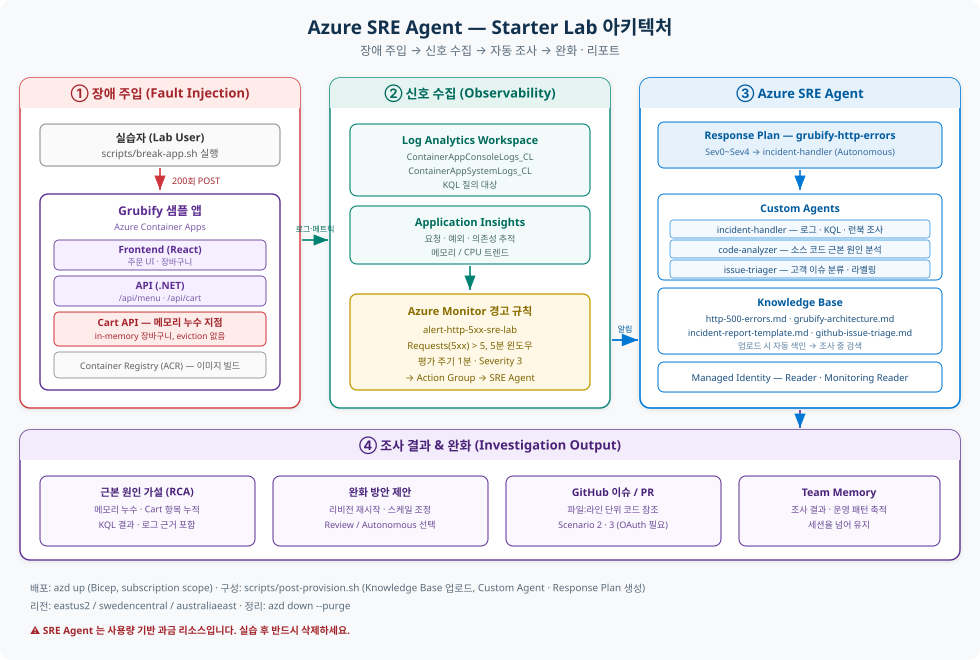

# Azure SRE Agent — 기능 소개 & 실습 Lab (한국어)

> Azure SRE Agent 를 배포하고, 샘플 앱을 의도적으로 망가뜨린 뒤,
> 에이전트가 **스스로 진단하고 완화**하는 과정을 확인하는 실습 저장소입니다.
>
> - 기능 설명: **[SRE_Agent.md](SRE_Agent.md)**
> - 원본 Lab: [microsoft/sre-agent — labs/starter-lab](https://github.com/microsoft/sre-agent/tree/main/labs/starter-lab) ([영문 README](docs/README.en.md))
> - **이 저장소의 모든 절차는 실제 Azure 구독에서 E2E 검증을 마쳤습니다.** → [6. E2E 실행 결과](#6-e2e-실행-결과)

<p align="center">
  
</p>

---

## 목차

1. [무엇을 배포하나요](#1-무엇을-배포하나요)
2. [사전 요구사항](#2-사전-요구사항)
3. [빠른 시작](#3-빠른-시작)
4. [배포 확인](#4-배포-확인)
5. [실습 시나리오](#5-실습-시나리오)
6. [E2E 실행 결과](#6-e2e-실행-결과)
7. [워크숍 운영 가이드 (반복 시연)](#7-워크숍-운영-가이드-반복-시연)
8. [정리 (Cleanup)](#8-정리-cleanup)
9. [트러블슈팅](#9-트러블슈팅)
10. [저장소 구조](#10-저장소-구조)

---

## 1. 무엇을 배포하나요

| 리소스 | 용도 |
|---|---|
| **SRE Agent** | Managed Identity · Knowledge Base · Custom Agent 를 갖춘 AI 에이전트 |
| **Grubify 앱** | 샘플 음식 주문 앱 (API + Frontend, Azure Container Apps) |
| **Log Analytics + App Insights** | 로그 저장 및 모니터링 |
| **Azure Monitor 경고** | HTTP 5xx 경고 → 에이전트 조사 자동 트리거 |
| **Container Registry (ACR)** | Grubify 컨테이너 이미지 빌드/저장 |
| **Managed Identity** | 에이전트가 Azure 를 조작할 때 쓰는 ID (권한은 아래 표 참고) |

### 권한 수준 선택 — Reader(기본값) vs Privileged

SRE Agent 는 생성 시 **권한 수준을 고릅니다.** Azure 기본값은 **Reader(읽기 전용)** 이며,
읽기 전용 상태에서도 조사·근본 원인 분석·리포트 작성은 **모두 그대로 동작**합니다.

> **이 Lab 은 의도적으로 `Privileged` 를 선택했습니다.**
> "에이전트가 조사만 하고 끝나는 것"이 아니라 **조치(완화)까지 스스로 수행하는 장면**을
> 재현해 보여주는 것이 데모 목표이기 때문입니다.
> 조사만 시연해도 충분하다면 **Reader 로도 이 Lab 의 대부분을 진행할 수 있습니다.**

#### 단계별로 — 어디까지 되고, 어디서 사람을 기다리나

| 인시던트 처리 단계 | Reader (기본값) | Privileged (이 Lab) |
|---|:--:|:--:|
| 경고 수신 · Acknowledge | ✅ | ✅ |
| Knowledge Base(런북·아키텍처) 검색 | ✅ | ✅ |
| 메트릭 · KQL 로그 질의 | ✅ | ✅ |
| 리비전 · 배포 이력 · 리소스 구성 조회 | ✅ | ✅ |
| 소스 코드에서 `파일:라인` 근본 원인 특정 *(코드 연결 시)* | ✅ | ✅ |
| 차트 생성 · 인시던트 리포트 작성 | ✅ | ✅ |
| Team Memory 에 학습 내용 저장 | ✅ | ✅ |
| GitHub 이슈/PR 생성 *(GitHub 연동 시)* | ✅ | ✅ |
| Azure Monitor 경고 **종료(Close)** | ✅ ※ | ✅ |
| 컨테이너 **재시작** | ⛔ → **OBO 승인 요청** | ✅ 직접 실행 |
| 메모리·CPU **스케일 변경** | ⛔ → **OBO 승인 요청** | ✅ 직접 실행 |
| 리소스 **설정 변경** | ⛔ → **OBO 승인 요청** | ✅ 직접 실행 |

> ※ `Monitoring Contributor` 는 **권한 수준과 무관하게 항상 부여**되는 기본 역할이라,
> Reader 를 선택해도 경고 확인·종료는 가능합니다. **차이가 생기는 지점은 "리소스 자체를 바꾸는" 조치입니다.**

#### Reader 만 선택했을 때 사용자가 보게 되는 것

1. 에이전트가 조사를 **끝까지 수행**하고 근본 원인과 완화 방안을 제시합니다.
2. 완화를 실행하려는 순간 **`Approve action` (OBO) 프롬프트**가 뜨고 멈춥니다.
3. **SRE Agent Administrator** 역할을 가진 사람이 승인하면, **그 사람의 자격 증명으로** 실행됩니다.
   (자격 증명은 저장되지 않으며, 작업 후 다시 관리 ID 로 돌아갑니다.)
4. Standard User·개인 Microsoft 계정은 승인할 수 없습니다. 직장/학교 계정만 가능합니다.

즉 Reader 는 **"진단은 완전 자동, 실행은 사람이 버튼 한 번"** 모델이고,
Privileged 는 **"진단부터 완화까지 무인"** 모델입니다.

#### 이 Lab 이 실제로 부여하는 역할

[infra/modules/subscription-rbac.bicep](infra/modules/subscription-rbac.bicep) 에서 **구독 범위**로 5개 역할을 할당합니다.

| 할당되는 역할 | 종류 | 부여 기준 | 에이전트가 할 수 있는 일 |
|---|:--:|---|---|
| `Reader` | 읽기 | 항상 | 리소스 구성·속성 조회 |
| `Monitoring Reader` | 읽기 | 항상 | 메트릭 · 모니터링 데이터 조회 |
| `Log Analytics Reader` | 읽기 | 항상 | KQL 로그 쿼리 |
| `Monitoring Contributor` | **쓰기** | 항상 | 경고 **확인 · 종료** |
| `Container Apps Contributor` | **쓰기** | **Privileged 선택 시** | Container App **재시작 · 스케일 · 설정 변경** |

> 마지막 한 줄이 이 Lab 을 Privileged 로 만듭니다. [6. E2E 결과](#6-e2e-실행-결과)에서 에이전트가
> **사람 승인 없이** 리비전 재시작 → 메모리 1Gi→2Gi 확장까지 수행할 수 있었던 근거입니다.

#### Reader 모드로 시연하려면 (선택)

OBO 승인 흐름을 보여주고 싶거나, 쓰기 권한을 부여할 수 없는 환경이라면
`Container Apps Contributor` 만 제거하면 됩니다.

```bash
# 배포 후 해당 역할만 회수 → Reader 상당으로 전환
PRINCIPAL_ID=$(az identity show -g rg-sre-lab \
  --name "$(az identity list -g rg-sre-lab --query '[0].name' -o tsv)" \
  --query principalId -o tsv)

az role assignment delete --assignee "$PRINCIPAL_ID" \
  --role "Container Apps Contributor" \
  --scope "/subscriptions/$(az account show --query id -o tsv)"
```

이 상태로 `break-app.sh` 를 실행하면 에이전트가 조사를 마친 뒤
**완화 단계에서 승인 프롬프트를 띄우고 대기**하는 것을 시연할 수 있습니다.

> 🔐 **운영 환경 권장:** 구독 범위 Contributor 부여를 피하고 **대상 리소스 그룹 범위**로만
> 필요한 역할을 주세요. 또한 신규 Response Plan 은 **Review 모드로 시작**해 동작을 검증한 뒤
> Autonomous 로 전환하는 것이 안전합니다.
> 전체 권한 모델(3계층 · 실행 모드 매트릭스 · OBO)은
> **[SRE_Agent.md — 권한 모델](SRE_Agent.md#6-권한-모델-permission-model)** 참고.

### SRE Agent 구성 요소

| 구성 요소 | 내용 |
|---|---|
| **Knowledge Base** | HTTP 오류 런북, 앱 아키텍처 문서, 인시던트 리포트 템플릿, 이슈 분류 기준 |
| **incident-handler** | 로그 · KQL · 런북 기반 조사 (도구 19종) |
| **code-analyzer** | 위 기능 + 소스 코드 검색, GitHub 이슈 생성 *(GitHub 연동 시)* |
| **issue-triager** | 고객 이슈 분류 · 라벨 · 코멘트 *(GitHub 연동 시)* |
| **Response Plan** | `grubify-http-errors` — Sev0~Sev4 경고를 `incident-handler` 로 Autonomous 라우팅 |
| **Scheduled Task** | 12시간마다 이슈 트리아지 *(GitHub 연동 시)* |
| **Global Tools** | DevOps + Python plotting 활성화 |

---

## 2. 사전 요구사항

| 도구 | Windows 설치 | macOS 설치 |
|---|---|---|
| [Azure CLI](https://learn.microsoft.com/cli/azure/install-azure-cli) 2.60+ | `winget install Microsoft.AzureCLI` | `brew install azure-cli` |
| [Azure Developer CLI](https://learn.microsoft.com/azure/developer/azure-developer-cli/install-azd) 1.9+ | `winget install Microsoft.Azd` | `brew install azd` |
| [Git](https://git-scm.com/) 2.x | `winget install Git.Git` | `brew install git` |
| [Python](https://python.org) 3.10+ | `winget install Python.Python.3.12` | `brew install python3` |

> **Windows 주의 (중요):** Python 설치 후 **설정 → 앱 → 앱 실행 별칭**에서 `python.exe`, `python3.exe` 를 **끄세요.**
> 켜져 있으면 `python3` 가 Microsoft Store 스텁으로 잡혀 구성 스크립트가 조용히 실패합니다.
> (이 저장소의 스크립트는 스텕을 자동 감지해 우회하도록 수정했습니다 — [6.7 발견·수정한 이슈](#67-실습-중-발견하고-수정한-이슈) 참고)
>
> Bash 스크립트는 **Git Bash** 로 실행합니다: `& "C:\Program Files\Git\bin\bash.exe" scripts/...`

### Azure 요구사항

- 구독에 **Owner** 권한 (구독 범위 RBAC 역할 할당 필요)
- 리소스 공급자 등록: `az provider register -n Microsoft.App --wait`
- 허용 리전: `eastus2`, `swedencentral`, `australiaeast`

### 선택 사항

- GitHub 계정 — 시나리오 2·3 을 위해 [dm-chelupati/grubify](https://github.com/dm-chelupati/grubify/fork) 를 fork

---

## 3. 빠른 시작

### 방법 A — 원커맨드 스크립트

```bash
git clone https://github.com/daeungo1/Azure-SRE-Agent-Lab.git
cd Azure-SRE-Agent-Lab
bash scripts/setup.sh
```

Windows(PowerShell):

```powershell
git clone https://github.com/daeungo1/Azure-SRE-Agent-Lab.git
cd Azure-SRE-Agent-Lab
& "C:\Program Files\Git\bin\bash.exe" scripts/setup.sh
```

### 방법 B — 단계별 수동 실행 (E2E 검증에 사용한 절차)

```bash
az login
azd auth login
az provider register -n Microsoft.App --wait

azd env new sre-lab --location eastus2 --subscription <subscription-id>
# 선택: azd env set GITHUB_USER <your-username>

azd up
bash scripts/post-provision.sh
```

> `azd up` 은 **인프라만** 만듭니다. 컨테이너 이미지 빌드(ACR Task)와
> SRE Agent 구성(Knowledge Base 업로드, Custom Agent · Response Plan 생성)은
> `scripts/post-provision.sh` 가 담당합니다. **두 단계 모두 실행해야 합니다.**

### 3단계 (선택) — 포털 기능 전체 채우기

기본 Lab 은 인시던트 자동 대응 하나만 구성합니다. 워크숍에서 SRE Agent 를 **제품 전체**로
소개하려면 [features-sre](features-sre) 를 적용해 포털의 빈 섹션을 채우세요.

```powershell
pwsh -File features-sre/scripts/apply-features.ps1
```

Skill Builder · Hooks · Agent Canvas · Automation · Knowledge Sources · Response Plans 가
실제 내용으로 채워집니다. 자세한 내용은 **[features-sre/README.md](features-sre/README.md)** 참고.

---

## 4. 배포 확인

```bash
bash scripts/post-provision.sh --status
```

`post-provision.sh` 마지막에 출력되는 검증 섹션이 아래처럼 모두 ✅ 여야 합니다.

```text
  📚 Knowledge Base:
     ✅ github-issue-triage.md
     ✅ grubify-architecture.md
     ✅ http-500-errors.md
     ✅ incident-report-template.md

  🤖 Subagents:
     ✅ incident-handler (19 tools)

  🚨 Response Plans:
     ✅ grubify-http-errors → subagent: incident-handler

  📡 Incident Platform:
     ✅ Azure Monitor
```

[sre.azure.com](https://sre.azure.com) 에서도 동일하게 확인할 수 있습니다.

| 확인 위치 | 기대 결과 |
|---|---|
| Settings → Knowledge Base → Files | 런북 파일이 색인(Indexed)됨 |
| Builder → Agent Canvas | `incident-handler` Custom Agent 존재 |
| Builder → Incident response plans | `grubify-http-errors` 플랜이 On |
| Settings → Incident platform | Azure Monitor 연결됨 |

---

## 5. 실습 시나리오

| # | 시나리오 | 대상 | 소요 | GitHub 필요 |
|:--:|---|---|:--:|:--:|
| 0 | **포털 투어** — 설정·Builder·Capabilities 둘러보기 | 전체 | 10분 | ❌ |
| 1 | 앱 장애 발생 → 에이전트가 로그 기반 조사·완화 | IT 운영 | 20분 | ❌ |
| 2 | 동일 장애 → 소스 코드에서 근본 원인 발견 + GitHub 이슈 생성 | 개발자 + IT | 20분 | ✅ |
| 3 | 고객 이슈 트리아지 → 분류·라벨·코멘트 자동화 | 워크플로 자동화 | 10분 | ✅ |
| 4 | **가치 측정** — Operations Hub · Live Reports 로 효과 확인 | 의사결정자 | 10분 | ❌ |

> 워크숍에서는 **0 → 1 → 4** 순서만으로도 완결된 스토리가 됩니다 (GitHub 불필요, 약 40분).

### 시나리오 0 — 포털 투어 (GitHub 불필요)

장애를 일으키기 전에 **에이전트가 어떤 재료로 일하는지**를 먼저 보여주세요.
[sre.azure.com](https://sre.azure.com) → 해당 에이전트 선택 후 순서대로 확인합니다.

| 순서 | 위치 | 볼 것 | 설명 포인트 |
|:--:|---|---|---|
| 1 | 상단 **Complete setup** (전체 설정) | 코드·로그·배포·인시던트·Azure 리소스·기술 자료 파일 | 연결한 소스가 많을수록 조사 품질이 올라간다 |
| 2 | **Settings ▸ Knowledge Base** | 업로드된 런북 4개가 색인(Indexed) 상태 | 에이전트가 *우리 팀 절차*를 따른다 |
| 3 | **Builder ▸ Agent Canvas** | `incident-handler` 와 연결된 도구 19종 | 도메인별 전문 에이전트를 직접 만든다 |
| 4 | **Builder ▸ Incident response plans** | `grubify-http-errors` → Autonomous | 사람 개입 없이 라우팅된다 |
| 5 | **Capabilities** | Built-in / 코드 실행 / 지식 / MCP 도구 목록 | 커넥터 없이도 Azure 진단은 바로 된다 |
| 6 | **Settings ▸ Managed resources** | 대상 리소스 그룹과 **권한 수준** | 이 Lab 은 쓰기 가능(Privileged) — 그래서 완화까지 한다 |
| 7 | **Favorites ▸ Team onboarding** | 최초 온보딩 대화 | `/learn` 으로 재시작 가능 |

그런 다음 **새 채팅**에서 가볍게 질문해 보세요 (채팅은 영어만 지원):

```text
What Azure resources are you managing right now? Give me a one-line summary of each.
```

```text
What do you already know about the Grubify application? Cite your knowledge sources.
```

### 시나리오 1 — IT 운영 (GitHub 불필요)

```bash
bash scripts/break-app.sh <API_URL> 200 0.5
```

`/api/cart/demo-user/items` 로 200회 POST 를 보내 **메모리 누수**를 유발합니다.
(in-memory 장바구니에 eviction 로직이 없음)

1. Grubify Frontend 를 열고 장바구니 담기 시도 → 실패 확인
2. **기다리기** — 경고 발화 → Response Plan 이 `incident-handler` 를 **자율 모드로 자동 실행**합니다
3. **Incidents** 메뉴에서 새 인시던트 행 → 조사 스레드 진입
4. 스레드에서 순서대로 보여주기:
   - `Reasoning` 블록 — 에이전트가 세운 **조사 계획(To-Do Plan)**
   - `Memory Search` — 런북·아키텍처 문서를 참조하는 장면
   - 메트릭/로그 병렬 수집 → **근본 원인 확정**
   - 완화 조치 실행 → 경고 종료 → 메모리 저장
5. 복구 확인: Grubify Frontend 에서 다시 장바구니 담기

> **수동 조사도 가능:** 자동 경고를 기다리지 않고 바로 보여주려면
> 새 채팅 → `/` 입력 → `incident-handler` 선택 후 아래 프롬프트를 보내세요.
>
> ```text
> The Grubify API is failing on "Add to Cart". Investigate and find the root cause,
> then propose a mitigation.
> ```
>
> 실제 소요 시간: 경고 발화 → 완화 약 5분, 최종 보고까지 약 14분 → [6. E2E 결과](#6-e2e-실행-결과)

### 시나리오 2 — 개발자 (GitHub 필요)

동일한 장애이지만, 코드 소스를 연결하면 에이전트가 추가로:

- Grubify 소스 코드에서 근본 원인 검색 → 정확한 `파일:라인` 식별
- 직전 배포와의 상관분석 ("이번 배포가 원인인가?")
- 코드 참조와 수정 제안이 포함된 GitHub 이슈 생성 (경우에 따라 수정 PR)

> 설정 방법: **Complete setup ▸ 코드** 카드에서 GitHub 연결 (OAuth 또는 PAT)
> 또는 `azd env set GITHUB_USER <username>` 후 `bash scripts/post-provision.sh --retry`
>
> 이슈 생성이 실패하면: `Use the GitHub API to create the issue if the direct tool isn't working`

### 시나리오 3 — 워크플로 자동화 (GitHub 필요)

```bash
bash scripts/create-sample-issues.sh <your-user>/grubify
```

**Builder ▸ Scheduled tasks ▸ triage-grubify-issues ▸ Run task now** 실행 후
각 `[Customer Issue]` 에 분류·라벨(`bug`, `api-bug`, `severity-high` 등)·트리아지 코멘트가 달립니다.

이어서 **Operations Hub ▸ Automation** 탭에서 방금 실행한 작업의
실행 횟수 · 성공률 · 평균 소요시간을 확인하면 자동화 운영 관점까지 연결됩니다.

> 직접 만들어보기(심화): **Connector → Custom Agent → Scheduled task** 3단 조립으로
> "매일 08:00 리소스 헬스 요약을 Teams 로 발송" 같은 작업을 만들 수 있습니다.

### 시나리오 4 — 가치 측정 (GitHub 불필요)

조사가 끝난 뒤, **이 에이전트가 정말 도움이 되었는가**를 숫자로 보여줍니다.

| 순서 | 위치 | 볼 것 |
|:--:|---|---|
| 1 | **Operations Hub ▸ Overview** | 데이터 소스 연결 상태 · Pending Actions · System Health · AAU 사용량 |
| 2 | **Operations Hub ▸ Incident Analytics** | 절감된 엔지니어링 시간 · 해결률 · 완화 중앙값(P50) · **IntentMet 점수** |
| 3 | **Operations Hub ▸ Automation** | 예약 작업·트리거 성공률과 실행 시간 |
| 4 | **Live Reports** | 보안 findings · 인시던트 요약 · 리소스 헬스 · 권장 조치 |
| 5 | 조사 스레드 ▸ **⋯ ▸ Copy link to thread** | Teams/Slack 공유용 딥링크 |

> 지표는 조사가 누적되면서 의미를 갖습니다. 첫 시연 직후에는 표본이 적을 수 있으므로,
> **"이런 것을 측정할 수 있다"** 는 관점으로 소개하는 것을 권장합니다.

### 보너스 프롬프트

**환경 파악**

```text
What is the public endpoint URL for the Grubify frontend container app?
```

```text
What recent changes were made to resources in my resource group? Check the Activity Log.
```

**진단 · 시각화** (Python 차트 도구 사용을 유도)

```text
Show me the CPU and memory usage trends for the Grubify container app over the last hour,
and plot requests vs memory on the same chart.
```

```text
Using the http-500-errors runbook, walk me through all the diagnostic KQL queries
and show me the results for the Grubify app.
```

**운영 점검**

```text
Check if there are any Azure Advisor recommendations for my resource group.
```

```text
Are there any reliability risks in this resource group? Single points of failure,
missing health probes, or undersized containers?
```

**팀 메모리** (저장 → 회상 데모)

```text
Remember that our on-call rotation is: Monday-Wednesday is Team Alpha,
Thursday-Sunday is Team Beta. Escalation path: on-call → team lead → VP Engineering.
```

```text
Who is on call today, and what should they check first if the cart API fails again?
```

---

## 6. E2E 실행 결과

> **실행일:** 2026-08-19 · **리전:** `eastus2` · **시나리오:** 1 (IT 운영, GitHub 미연동)
> 모든 타임스탬프는 **UTC** 기준입니다.

### 6.1 배포 결과

`azd up` 으로 생성된 리소스 (리소스 그룹 `rg-sre-lab`):

| 리소스 | 이름 | 소요 |
|---|---|---|
| Resource Group | `rg-sre-lab` | 6s |
| Application Insights | `appi-huvqg3bjooyw6` | 25s |
| Log Analytics workspace | `law-huvqg3bjooyw6` | 22s |
| Container Registry | `acrcagrubifyhuvqg3bjooyw6` | 10s |
| Container Apps Environment | `cae-huvqg3bjooyw6` | 58s |
| Container App (API) | `ca-grubify-huvqg3bjooyw6` | 17s |
| Container App (Frontend) | `ca-grubify-fe-huvqg3bjooyw6` | — |
| **SRE Agent** | `sre-agent-huvqg3bjooyw6` | — |
| Metric Alert | `alert-http-5xx-sre-lab` (Sev3, 5xx > 5 / 5분, 평가 1분) | — |

`scripts/post-provision.sh` 결과: ACR 이미지 2종 빌드·배포, CORS 구성,
Knowledge Base 4개 파일 색인, `incident-handler`(19 tools), Response Plan, Azure Monitor 연결 — **전부 성공**.

### 6.2 장애 주입 결과

```text
Target:   https://ca-grubify-huvqg3bjooyw6...azurecontainerapps.io
Requests: 200 (interval 0.5s)

00:11 UTC  시작 — App is healthy (HTTP 200)
00:14 UTC  25/200 → 오류 0건
00:16 UTC  75/200 → 오류 2건   ← 최초 5xx 발생
00:17 UTC  100/200 → 오류 26건
00:19 UTC  200/200 → 오류 126건

Results: 74 successes, 126 errors out of 200 requests
```

### 6.3 에이전트 자동 조사 타임라인

Azure Monitor 경고 → Response Plan → `incident-handler`(Autonomous) 로
**사람 개입 없이** 진행된 실제 기록입니다.

| 시각(UTC) | 이벤트 |
|---|---|
| 00:17:47 | 경고 `alert-http-5xx-sre-lab` (Sev3) **발화** |
| 00:18:41 | 에이전트가 경고 **수신·확인(Acknowledged)** 후 조사 시작 |
| 00:19:15 | **Knowledge Base 검색** — 유사 인시던트 3건 / 런북 4건 조회 |
| 00:19:30 | Grubify 아키텍처 문서 · 인시던트 템플릿 · HTTP 500 런북 로드 |
| 00:19:38 | Container Apps 진단 스킬 로드, 앱 정보·메트릭·로그·리비전 **병렬 수집** |
| 00:20:57 | 분석: CPU 최대 1% (원인 아님), 메모리 3%→5%, 트래픽 32 req/min |
| 00:22:06 | **근본 원인 확정** — `System.OutOfMemoryException` |
| 00:22:20 | **완화 1** — 리비전 재시작 + 요청/메모리 상관 차트 생성 |
| 00:22:50 | **완화 2** — 메모리 1Gi → 2Gi 확장, 새 리비전 `--0000003` 생성 |
| 00:24:11 | **Azure Monitor 경고 종료(Close)** |
| 00:29:58 | 경고 상태 `Resolved` 로 전환 확인 |
| 00:30:05 | 인시던트 리포트 파일 생성 (`incident-report-2026-08-19-oom-cart-api.md`, 113줄) |
| 00:31:37 | **Team Memory 저장** — `debugging.md`, `overview.md`, `grubify-oom-cart-api-incident.md` |
| 00:32:11 | 최종 요약 보고 완료 |

**측정 지표**

| 항목 | 값 |
|---|---|
| 감지(MTTD) — 최초 5xx → 경고 발화 | 약 3분 |
| 완화(MTTR) — 경고 발화 → 메모리 확장 적용 | **약 5분** |
| 전체 조사 완료 — 경고 발화 → 최종 보고 | **약 14분** |
| 사람 개입 | **0회** |

### 6.4 에이전트가 도출한 근본 원인

에이전트 최종 보고 원문(요약):

> **Root Cause**
> `System.OutOfMemoryException` in `CartController.AddItemToCart` at `/app/Controllers/CartController.cs:line 30`.
> The in-memory cart store uses an unbounded dictionary with no eviction — under ~32 req/min,
> it exhausted the container's 1Gi memory limit, causing 25+ HTTP 500 failures across 8 Kestrel
> connections in a 40-second window.

즉, **파일명과 라인 번호 수준까지** 원인을 특정했습니다.
근거로 Log Analytics 로그, 요청/메모리 상관 차트, 리비전 이력을 함께 제시했습니다.

### 6.5 완화 결과 검증

에이전트 조치 후 실제 상태:

```text
Name                               Active  Replicas  Health   Memory  Cpu
ca-grubify-huvqg3bjooyw6--0000003  True    1         Healthy  2Gi     1.0
```

```text
POST /api/cart/demo-user/items   → HTTP 200 (463ms)
GET  frontend /                  → HTTP 200 (700ms)
```

메모리 `1Gi → 2Gi`, CPU `0.5 → 1.0` 으로 확장된 새 리비전이 정상 동작하며, 서비스가 복구되었습니다.

### 6.6 GitHub 미연동 시의 제약 (재현됨)

`GITHUB_USER` 를 설정하지 않고 실행했기 때문에, 에이전트는 GitHub 이슈 생성 단계에서
`GitHub authorization failed. User must be logged in.` 로 실패했습니다.
에이전트는 이를 **스스로 인지하고** 대체 경로(gh CLI → curl → 커넥터 설정 확인)를 시도한 뒤,
최종적으로 인시던트 리포트를 **파일로 저장**하고 사용자에게 GitHub 계정 연결을 요청했습니다.

> 시나리오 2·3 을 실행하려면 `azd env set GITHUB_USER <username>` 후
> `bash scripts/post-provision.sh --retry` 를 실행하고, 출력되는 **OAuth URL 에서 브라우저 승인**이 필요합니다.
> (이 단계는 대화형이라 자동화되지 않습니다.)

### 6.7 실습 중 발견하고 수정한 이슈

원본 starter-lab 을 실제로 돌리면서 발견한 문제 3건을 이 저장소에서 수정했습니다.

| # | 증상 | 근본 원인 | 수정 |
|---|---|---|---|
| 1 | `incident-handler returned HTTP 400` — subagent 생성 실패 | Windows 에서 `command -v python3` 가 **Microsoft Store 별칭 스텁**을 찾음. 스텁은 출력이 없고 stderr 안내문만 내보내는데, 스크립트가 `2>&1` 로 캡처해 그 텍스트를 JSON 대신 요청 본문으로 전송 | [scripts/post-provision.sh](scripts/post-provision.sh), [scripts/setup.sh](scripts/setup.sh) — 후보 인터프리터를 **실제 실행해보고** 검증하도록 변경 |
| 2 | `Response plan failed after 5 attempts (HTTP 400)` | 데이터플레인 API 가 `maxAttempts` 속성을 거부 (`Unknown incident filter properties: maxAttempts`). 서버가 `maxAutomatedInvestigationAttempts` 를 자동 설정 | [scripts/post-provision.sh](scripts/post-provision.sh) — 페이로드에서 `maxAttempts` 제거 |
| 3 | 검증 섹션이 공백으로 출력 / 헬스체크가 항상 404 | (a) 한국어 등 비 UTF-8 Windows 로캘에서 이모지 출력 실패 (b) 배포된 API 에 `/health`·`/api/menu` 라우트가 없음 (실제: `/api/fooditems`, `/api/restaurants`, `/api/cart/{user}`) | `PYTHONIOENCODING=utf-8` 설정 + [scripts/break-app.sh](scripts/break-app.sh) 헬스체크 경로 교정 |

추가로 subagent 생성 PUT 이 **비동기(202)** 라 연속 호출 시 일시적으로 400 이 나는 현상이 있어,
`post-provision.sh` 의 subagent 생성에 **재시도 로직**을 넣었습니다.

---

## 7. 워크숍 운영 가이드 (반복 시연)

환경을 삭제하지 않고 **여러 번 시연**할 때만 필요한 내용입니다.

### 7.1 데모 재현을 위한 필수 리셋

에이전트가 장애를 완화하면서 **컨테너 리소스를 확장**합니다.
따라서 시연 직후의 상태 그대로는 **동일한 OOM 장애가 재현되지 않습니다.**

| 구분 | 배포 직후 (장애 재현 ⭕) | 에이전트 완화 후 (장애 재현 ❌) |
|---|---|---|
| CPU | `0.5` | `1.0` |
| Memory | `1Gi` | `2Gi` |

**다음 시연 전에 반드시 원래 사양으로 되돌리세요.**

```powershell
# PowerShell — 앱 이름을 azd 환경에서 자동으로 가져옵니다
$app = azd env get-value CONTAINER_APP_NAME
$rg  = azd env get-value AZURE_RESOURCE_GROUP
az containerapp update --name $app --resource-group $rg --cpu 0.5 --memory 1Gi
az containerapp show   --name $app --resource-group $rg `
  --query "properties.template.containers[0].resources" -o json
```

```bash
# bash
az containerapp update --name "$(azd env get-value CONTAINER_APP_NAME)" \
  --resource-group "$(azd env get-value AZURE_RESOURCE_GROUP)" \
  --cpu 0.5 --memory 1Gi
```

### 7.2 시연 전 체크리스트

| # | 항목 | 확인 방법 |
|:--:|---|---|
| 1 | 컨테너 사양이 `0.5 CPU / 1Gi` 로 리셋됨 | [7.1](#71-데모-재현을-위한-필수-리셋) |
| 2 | 앱이 정상 응답 | `POST /api/cart/demo-user/items` → 200 |
| 3 | Response Plan 이 On 상태 | `bash scripts/post-provision.sh --status` 또는 Builder ▸ Incident response plans |
| 4 | 직전 경고가 `Resolved` 상태 | Azure Portal ▸ Monitor ▸ Alerts |
| 5 | 이전 조사 스레드 정리(선택) | sre.azure.com ▸ Search Threads |

> **재조사 쿼다운(Reinvestigation cooldown):** Azure Monitor 연동 시 기본 3시간 동안
> 동일 경고 규칙의 재발화는 **새 조사를 시작하지 않고 기존 스레드에 병합**됩니다.
> 같은 날 여러 번 시연하려면 **Builder ▸ Incident response plans** 에서
> 해당 플랜의 **Reinvestigation cooldown 을 1시간으로 줄이거나 비활성화**하세요.

### 7.3 장애 주입 강도 조절

경고 조건은 **5분 창에서 5xx 가 5건 초과** 입니다.

```bash
bash scripts/break-app.sh <API_URL> 200 0.5   # 검증된 기본값: 약 2분, 5xx 약 126건
bash scripts/break-app.sh <API_URL> 150 0.3   # 더 빠른 시연이 필요할 때
```

최초 5xx 발생까지 약 3분, 경고 발화까지 약 3분, 에이전트 완화까지 경고 발화 후 약 5분.
**세션 시간을 최소 20분 확보**하세요.

### 7.4 시연 사이 비용 절감

```bash
az containerapp update --name <APP> --resource-group rg-sre-lab --min-replicas 0  # 대기
az containerapp update --name <APP> --resource-group rg-sre-lab --min-replicas 1  # 시연 전 복구
```

> **SRE Agent 자체는 사용량 기반(AAU) 과금**이므로 조사를 실행하지 않으면 큰 비용이 발생하지 않지만,
> Log Analytics · Container Apps · ACR 은 상시 과금됩니다.
> 사용량은 **Operations Hub ▸ Overview** 또는 Settings 에서 확인하세요.

### 7.5 시연 동선 제안 (50분)

| 순서 | 내용 | 자료 | 소요 |
|:--:|---|---|---|
| 1 | SRE Agent 란 무엇인가 — 한 줄 요약과 동작 흐름 | [SRE_Agent.md §1~2](SRE_Agent.md) | 5분 |
| 2 | 포털 투어 (설정 · Builder · Capabilities · 권한) | [시나리오 0](#시나리오-0--포털-투어-github-불필요) | 10분 |
| 3 | 정상 동작 시연 후 `break-app.sh` 실행 | [시나리오 1](#시나리오-1--it-운영-github-불필요) | 3분 |
| 4 | 대기 중 — 아키텍처·런북·권한 모델 설명 | [architecture-ko.svg](docs/architecture-ko.svg) · [SRE_Agent.md §6](SRE_Agent.md#6-권한-모델-permission-model) | 10분 |
| 5 | Incidents ▸ 조사 스레드 실시간 시청 | 포털 | 10분 |
| 6 | 근본 원인·완화 결과 리뷰, E2E 기록과 비교 | [6. E2E 결과](#6-e2e-실행-결과) | 5분 |
| 7 | Operations Hub · Live Reports 로 가치 측정 | [시나리오 4](#시나리오-4--가치-측정-github-불필요) | 7분 |

---

## 8. 정리 (Cleanup)

```bash
azd down --purge
```

> ⚠️ **SRE Agent 는 사용량 기반 과금 리소스입니다.** 환경을 더 이상 쓰지 않으면 삭제하세요.
> `--purge` 를 붙여야 Log Analytics / Application Insights 가 soft-delete 상태로 남지 않습니다.
> 워크숍 용도로 **환경을 유지**한다면 [7. 워크숍 운영 가이드](#7-워크숍-운영-가이드-반복-시연)를 따르세요.

---

## 9. 트러블슈팅

| 증상 | 해결 |
|---|---|
| Windows 에서 스크립트가 조용히 실패 / `python3` 못 찾음 | 앱 실행 별칭(Store alias) 끄고 터미널 재시작 |
| Response Plan 생성 시 HTTP 400/405 | 30초 대기 후 `bash scripts/post-provision.sh --retry` |
| subagent 생성 HTTP 400 | 직전 PUT 이 비동기 처리 중일 수 있음. 15초 후 재시도 (스크립트에 내장) |
| GitHub 이슈 생성 실패 | `azd env set GITHUB_USER <username>` → `--retry` → **브라우저에서 OAuth 승인** |
| `az login` 이 잘못된 계정 사용 | `az logout` 후 `az login --use-device-code` |
| `azd up` 리전 오류 | `azd env set AZURE_LOCATION eastus2` 후 재실행 |
| Container App 이 `Waiting` 상태 | ACR 이미지 빌드 대기 — `post-provision.sh` 를 먼저 실행했는지 확인 |
| 경고가 발화하지 않음 | 5xx 가 5분 창에서 5건을 넘어야 함. `break-app.sh` 요청 수를 늘리세요 |
| 두 번째 시연에서 장애가 재현되지 않음 | 에이전트가 메모리를 확장해 둔 상태 — [7.1 데모 리셋](#71-데모-재현을-위한-필수-리셋) 수행 |
| 경고는 떴는데 새 조사가 안 생김 | 재조사 쿼다운(기본 3시간)으로 기존 스레드에 병합됨 — [7.2](#72-시연-전-체크리스트) 참고 |
| 포털이 응답 없음 / 채팅 불가 | 방화벽·프록시가 `*.azuresre.ai` 를 차단했는지 확인 (허용 목록 추가) |
| 에이전트가 조치를 못하고 승인만 요청 | 권한 수준이 Reader 일 수 있음 — [SRE_Agent.md §6](SRE_Agent.md#6-권한-모델-permission-model) 참고 |

---

## 10. 저장소 구조

```text
.
├── README.md                        # 이 문서 (실습 가이드 + E2E 결과 + 워크숍 운영)
├── SRE_Agent.md                     # Azure SRE Agent 기능 소개 (포털·기능·권한 전반)
├── azure.yaml                       # azd 템플릿 정의
├── docs/
│   ├── architecture-ko.svg          # Lab 아키텍처 (한국어)
│   ├── architecture.svg             # Lab 아키텍처 (원본)
│   ├── sre-agent-hook-timeline-ko.svg # 사람 대응 vs 에이전트 대응 타임라인
│   ├── sre-agent-flow-ko.svg        # 에이전트 동작 흐름
│   ├── sre-agent-portal-map-ko.svg  # 포털 기능 지도
│   ├── sre-agent-permissions-ko.svg # 권한 모델
│   └── README.en.md                 # 원본(영문) starter-lab README
├── features-sre/                    # 포털 기능 채우기 — Skill · Hook · Agent · Automation
│   ├── README.md                    # 포털 섹션 ↔ 파일 매핑 · 적용 방법
│   ├── skills/ hooks/ agents/       # Skill Builder · Hooks · Agent Canvas
│   ├── automation/ response-plans/  # 스케줄 작업 · 응답 계획
│   ├── knowledge/ connectors/       # 지식 문서 · 커넥터
│   └── scripts/apply-features.ps1   # 일괄 적용 (재실행 안전)
├── infra/                           # Bicep IaC (subscription scope)
│   ├── main.bicep
│   ├── resources.bicep
│   └── modules/                     # monitoring · identity · container-app · sre-agent · alert-rules · rbac
├── knowledge-base/                  # SRE Agent 에 업로드되는 런북 · 문서
├── lab/                             # Skillable 랩 진행용 지침
├── scripts/                         # setup · post-provision · break-app · 샘플 이슈 생성
└── sre-config/                      # Custom Agent(YAML) · 커넥터 정의
```

---

## 참고

| 항목 | 링크 |
|---|---|
| SRE Agent 포털 | [sre.azure.com](https://sre.azure.com) |
| 공식 문서 | [learn.microsoft.com/azure/sre-agent](https://learn.microsoft.com/azure/sre-agent/overview) |
| 블로그 | [aka.ms/sreagent/blog](https://aka.ms/sreagent/blog) |
| 가격 | [aka.ms/sreagent/pricing](https://aka.ms/sreagent/pricing) |
| 원본 Lab | [microsoft/sre-agent](https://github.com/microsoft/sre-agent) |
