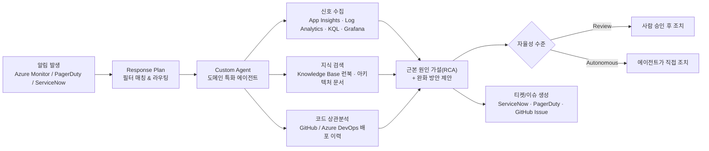

# Azure SRE Agent 기능 소개

> Azure SRE Agent는 운영 업무(toil)를 자동화하는 Azure 관리형 AI 에이전트입니다.
> 관측(Observability) 도구 · 인시던트 플랫폼 · 소스 코드 저장소를 하나의 자동화된 워크플로로 연결합니다.
>
> 공식 문서: [learn.microsoft.com/azure/sre-agent](https://learn.microsoft.com/azure/sre-agent/overview) · 포털: [sre.azure.com](https://sre.azure.com)

---

## 1. 한 줄 요약

새벽 3시에 알림이 울렸을 때, Grafana → PagerDuty → Slack 을 오가는 대신
**이미 답이 채워진 하나의 조사 결과(Investigation)** 를 받습니다.
무엇이 바뀌었고, 무엇이 영향을 받았고, 다음에 무엇을 해야 하는지까지 포함해서요.

> 에이전트는 **변경을 제안(propose)** 하고, 팀이 **승인(approve)** 합니다.
> 사람의 승인 없이 배포되는 변경은 없습니다. (Autonomous 모드는 별도 동의 필요)

---

## 2. 동작 흐름

---

## 3. 핵심 기능

### 3.1 인시던트 자동화 (Incident Automation)

| 단계 | 에이전트가 하는 일 |
|---|---|
| 1. 수신 | Azure Monitor Alerts / PagerDuty / ServiceNow 에서 알림 수신 |
| 2. 보강 | Application Insights, Log Analytics, Grafana 에 KQL 질의하여 상관 신호 수집 |
| 3. 분석 | 근본 원인 가설(root cause hypothesis) 생성, 배포 이력과 상관분석 |
| 4. 제안 | 완화(mitigation) 방안 제시 |
| 5. 기록 | 조사 요약 · 제안 조치 · 승인 액션이 포함된 티켓/이슈 생성 |

효과: **MTTR 단축**, 가용성 개선, 장애 패턴의 조기 발견.

### 3.2 Response Plan (인시던트 대응 계획)

인시던트를 **어떤 Custom Agent 가, 어떤 자율성 수준으로** 처리할지 규칙으로 정의합니다.

| 필터 조건 | 설명 | 예시 |
|---|---|---|
| Severity / Priority | 심각도 (복수 선택 가능) | Sev0~Sev4, P1+P2 |
| Impacted service | 영향받은 서비스 | `api-gateway` |
| Incident type | 분류 | Default, Major, Security |
| Title contains | 제목 키워드 매칭 | `"Out of memory"` |

| 자율성 수준 | 동작 |
|---|---|
| **Review** | 조치를 제안하고 **승인을 기다림** (신규 플랜 권장) |
| **Autonomous** | 승인 없이 직접 조사·완화 수행 |

> ⚠️ 인시던트 플랫폼을 처음 연결하면 기본 `quickstart` Response Plan 이 자동 생성됩니다.
> 직접 만든 플랜과 **중복 라우팅**이 발생할 수 있으므로 삭제하는 것이 좋습니다.
> (이 Lab의 `post-provision.sh` 는 이 작업을 자동으로 수행합니다.)

### 3.3 Custom Agent / Subagent

특정 운영 도메인에 특화된 에이전트를 정의합니다. 채팅에서 `/` 를 입력해 직접 호출하거나,
Response Plan · Scheduled Task 의 핸들러로 연결할 수 있습니다.

- 기본 제공 subagent 6종: `Explore`, `Plan`, `CodeReview`, `Bash`, `Verification`, `GeneralPurpose`
- 조사 · 계획 · 리뷰 · 셸 · 검증 작업을 **병렬로 분산** 실행

이 Lab 에서 만드는 Custom Agent:

| 이름 | 역할 | 정의 파일 |
|---|---|---|
| `incident-handler` | 로그 · KQL · 런북 기반 인시던트 조사 | [sre-config/agents/incident-handler-full.yaml](sre-config/agents/incident-handler-full.yaml) |
| `code-analyzer` | 위 기능 + 소스 코드 검색, GitHub 이슈 생성 | [sre-config/agents/code-analyzer.yaml](sre-config/agents/code-analyzer.yaml) |
| `issue-triager` | 고객 이슈 분류 · 라벨링 · 코멘트 | [sre-config/agents/issue-triager.yaml](sre-config/agents/issue-triager.yaml) |

### 3.4 Knowledge Base (지식 베이스)

런북 · 아키텍처 문서 · 포스트모템을 업로드하면 에이전트가 자동으로 색인하여 조사 시 참조합니다.

- 지원 형식: Markdown(`.md`), 텍스트(`.txt`) — 파일당 최대 50 MB, 인스턴스당 최대 1,000 파일
- 권장 콘텐츠: 아키텍처 설계, 트러블슈팅 가이드, 런북/SOP, 인시던트 리포트, 릴리스 노트

이 Lab 에 포함된 지식 파일:

| 파일 | 내용 |
|---|---|
| [knowledge-base/http-500-errors.md](knowledge-base/http-500-errors.md) | HTTP 500 오류 진단 런북 (KQL 쿼리 포함) |
| [knowledge-base/grubify-architecture.md](knowledge-base/grubify-architecture.md) | 샘플 앱 아키텍처 문서 |
| [knowledge-base/incident-report-template.md](knowledge-base/incident-report-template.md) | 인시던트 리포트 템플릿 |
| [knowledge-base/github-issue-triage.md](knowledge-base/github-issue-triage.md) | GitHub 이슈 분류 기준 |

### 3.5 확장 프리미티브 (Extension Primitives)

에이전트는 5가지 확장 수단을 제공합니다.

| 프리미티브 | 용도 |
|---|---|
| **Skills** | 마켓플레이스 런북 · Azure CLI 스크립트 등 개별 기능 추가 |
| **Subagents** | 특정 운영 도메인 전문 에이전트 |
| **Python tools** | 설정으로 표현 불가한 커스텀 로직 · 데이터 변환 · API 연동 |
| **MCP servers** | Datadog, New Relic, Splunk, Elasticsearch, Dynatrace 등 40+ 커넥터 또는 자체 MCP 도구 |
| **Agent hooks** | 조사 전/해결 후 시점에 실행되는 이벤트 기반 자동화 (정책 강제, 텔레메트리 전송) |

> 5가지 모두 **Permission Gate**(사전 실행 안전 계층)의 통제를 받습니다.
> 모든 도구 호출은 실행 전에 평가되며, 사람 승인 요구 · 정책 강제 · 차단이 가능합니다.
> 감사 로그는 자체 Application Insights 인스턴스로 전송됩니다.

### 3.6 Scheduled Task (예약 작업)

헬스 체크, 정리 작업, 컴플라이언스 스윕 등 반복 운영 업무를 IaC 작성 없이 일정 기반으로 실행합니다.
결과는 연결된 인시던트 플랫폼 또는 알림 채널로 전달됩니다.

이 Lab 에서는 12시간마다 GitHub 이슈를 분류하는 `triage-grubify-issues` 작업을 생성합니다.

### 3.7 Team Memory (팀 지식 축적)

모든 조사가 에이전트에게 학습됩니다. 근본 원인 · 해결 절차 · 팀 선호 · 운영 패턴이 축적되어
대화 세션을 넘어 유지됩니다.

- 신규 팀원이 첫 온콜부터 일정한 품질로 대응 가능
- "이 시스템은 나만 안다" 라는 단일 장애점(SPOF) 해소

| 시점 | 기대 효과 |
|---|---|
| Day 1 | 도구 연결, 첫 인시던트 트리아지, 내장 Azure 지식 기반 즉시 진단 |
| Week 1 | 환경 토폴로지 · 장애 패턴 · 에스컬레이션 선호 학습, 조사 속도/정확도 향상 |
| Month 1 | 조직 지식 축적, 장애 패턴의 사전 포착, 신규 팀원 즉시 기여 |

---

## 4. 관리 대상 Azure 서비스

| 범주 | 서비스 |
|---|---|
| Compute | Virtual Machines, App Service, Container Apps, AKS, Functions |
| Storage | Blob, File Share, Managed Disk, Storage Account |
| Networking | VNet, Load Balancer, Application Gateway, NSG |
| Database | Azure SQL, Cosmos DB, PostgreSQL, MySQL, Redis |
| Monitoring | Azure Monitor, Log Analytics, Application Insights, ARM |

Runbook · Subagent · Agent hook 를 통해 **모든 Azure CLI 작업**을 자동화할 수 있습니다.

---

## 5. 통합 (Integrations)

| 범주 | 지원 대상 |
|---|---|
| 모니터링/관측 | Azure Monitor(메트릭·로그·알림·워크북), Application Insights, Log Analytics, Grafana |
| 인시던트 관리 | Azure Monitor Alerts, PagerDuty, ServiceNow |
| 소스 관리/CI-CD | GitHub(리포지토리·이슈), Azure DevOps(리포·작업 항목) |
| 데이터 소스 | Azure Data Explorer(Kusto), MCP 서버 |
| 알림/커뮤니케이션 | Slack, Microsoft Teams |

---

## 6. 에이전트 생성 시 함께 만들어지는 리소스

SRE Agent 리소스를 만들면 다음이 자동으로 생성됩니다.

- Azure Application Insights
- Log Analytics workspace
- Managed Identity

에이전트의 관측성과 ID 관리를 담당하며, 구독 내에서 직접 확인·관리할 수 있습니다.

---

## 7. 고려사항 (Considerations)

- 채팅 인터페이스는 **영어만 지원**합니다. (문서·런북은 한국어로 작성해도 색인되지만, 프롬프트는 영어 권장)
- 리전 및 테넌트 구성에 따라 **가용성이 다릅니다.** 이 Lab 은 `swedencentral`, `eastus2`, `australiaeast` 만 허용합니다.
- **사용량 기반 과금**입니다. 실습 후 반드시 `azd down --purge` 로 정리하세요.
  자세한 내용은 [Pricing and billing](https://learn.microsoft.com/azure/sre-agent/pricing-billing) 참고.
- 모든 AI 시스템과 마찬가지로 **잘못된 결론이나 부적절한 완화 방안을 제안할 수 있습니다.**
  승인 전 반드시 검토하세요.

---

## 8. 참고 링크

| 항목 | 링크 |
|---|---|
| SRE Agent 포털 | [sre.azure.com](https://sre.azure.com) |
| 개요 문서 | [Overview of Azure SRE Agent](https://learn.microsoft.com/azure/sre-agent/overview) |
| Custom agents | [Custom agents in Azure SRE Agent](https://learn.microsoft.com/azure/sre-agent/sub-agents) |
| Response plans | [Incident response plans](https://learn.microsoft.com/azure/sre-agent/incident-response-plans) |
| Incident platforms | [Incident platforms](https://learn.microsoft.com/azure/sre-agent/incident-platforms) |
| Agent hooks | [Agent hooks](https://learn.microsoft.com/azure/sre-agent/agent-hooks) |
| 보안 개요 | [Security overview](https://learn.microsoft.com/azure/sre-agent/security-overview) |
| 가격 | [Pricing and billing](https://learn.microsoft.com/azure/sre-agent/pricing-billing) |
