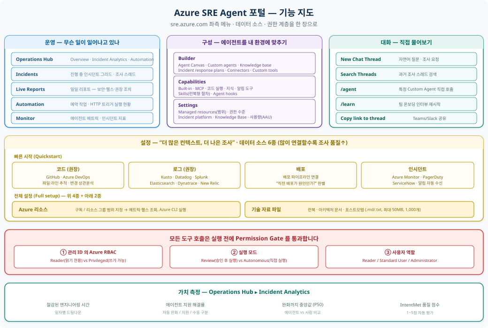
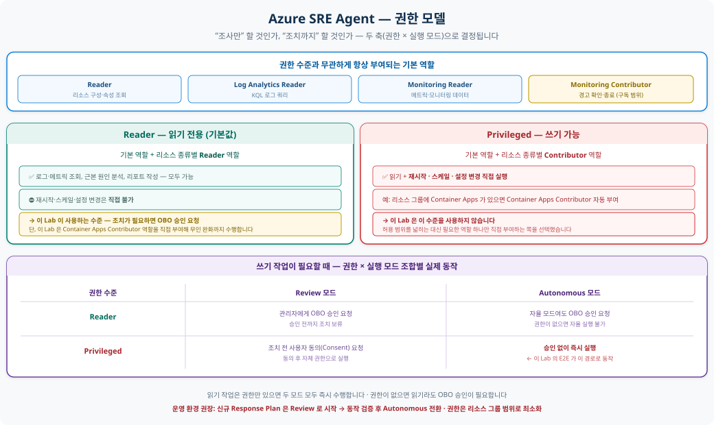

# Azure SRE Agent 기능 소개

> Azure SRE Agent 는 운영 업무(toil)를 자동화하는 Azure 관리형 AI 에이전트입니다.
> 관측(Observability) 도구 · 인시던트 플랫폼 · 소스 코드 저장소를 하나의 자동화된 워크플로로 연결합니다.
>
> 포털 [sre.azure.com](https://sre.azure.com) · 공식 문서 [learn.microsoft.com/azure/sre-agent](https://learn.microsoft.com/azure/sre-agent/overview)
> 실제 검증 결과는 **[README — E2E 실행 결과](README.md#6-e2e-실행-결과)** 참고

> 처음 보시는 분은 **[SRE Agent 개요](OVERVIEW.md)** 를 먼저 읽으세요 — 이 문서의 핵심을 5분 분량으로 정리한 문서입니다.

---

## 목차

1. [동작 흐름](#1-동작-흐름)
2. [포털 한눈에 보기](#2-포털-한눈에-보기)
3. [초기 설정 — 데이터 소스 6종](#3-초기-설정--데이터-소스-6종)
4. [핵심 기능](#4-핵심-기능)
5. [권한 모델 (Permission Model)](#5-권한-모델-permission-model)
6. [관리 대상 Azure 서비스 & 통합](#6-관리-대상-azure-서비스--통합)
7. [함께 생성되는 리소스](#7-함께-생성되는-리소스)
8. [비용은 어떻게 발생하나요](#8-비용은-어떻게-발생하나요)
9. [보안과 네트워크는 어떻게 통제하나요](#9-보안과-네트워크는-어떻게-통제하나요)
10. [도입 전 체크리스트](#10-도입-전-체크리스트)
11. [알아두어야 할 제한 사항](#11-알아두어야-할-제한-사항)
12. [참고 링크 & 데모 영상](#12-참고-링크--데모-영상)

---

## 1. 동작 흐름

<p align="center">
  
</p>

| 단계 | 무슨 일이 일어나나 |
|---|---|
| ① 신호 수신 | Azure Monitor · PagerDuty · ServiceNow 에서 알림을 받습니다 |
| ② Response Plan | 심각도·서비스·키워드 필터로 **담당 Custom Agent 와 자율성 수준**을 결정합니다 |
| ③ 조사 | 관측 데이터 · Knowledge Base · 코드/배포 이력을 **병렬로** 조회하며 증거를 모읍니다 |
| ④ RCA | 근본 원인 가설을 세우고 완화 방안을 제시합니다 |
| ⑤ 조치 & 기록 | 완화 실행(또는 승인 요청) · 경고 종료 · 리포트/이슈 생성 · Memory 저장 |

---

## 2. 포털 한눈에 보기

<p align="center">
  
</p>

### 좌측 메뉴 — 운영 (무슨 일이 일어나고 있나)

| 메뉴 | 용도 | 실습에서 볼 것 |
|---|---|---|
| **Operations Hub** | 에이전트 운영 현황 통합 대시보드 (Overview / Incident Analytics / Automation) | 조사 후 절감 시간·해결률 확인 |
| **Incidents** | 진행 중인 인시던트 그리드. 각 행 → 조사 스레드로 연결 | 자동 조사 스레드 열람 |
| **Live Reports** | 자동 생성 일일 리포트 (보안 취약점 · 인시던트 · 리소스 헬스 · 권장 조치) | "밤새 무슨 일이?" 를 대체 |
| **Automation** | 예약 작업 · HTTP 트리거 실행 현황 | 이슈 트리아지 작업 실행 |
| **Monitor** | 에이전트 메트릭 · 인시던트 지표 | — |

### 좌측 메뉴 — 구성 (내 환경에 맞추기)

| 메뉴 | 하위 항목 |
|---|---|
| **Builder** | Agent Canvas · Custom agents · Knowledge base · Incident response plans · Connectors · Custom tools |
| **Capabilities** | Built-in / MCP / 코드 실행 / 지식 / 알림 도구, Skills, Agent hooks |
| **Settings** | Managed resources(범위) · 권한 수준 · Incident platform · Knowledge Base · 사용량(AAU) |

### 좌측 메뉴 — 대화

| 항목 | 설명 |
|---|---|
| **New Chat Thread** | 자연어로 질문·조사 요청 (채팅은 **영어만 지원**) |
| **Search Threads** | 과거 조사 스레드 검색 |
| `/agent` | 특정 Custom Agent 를 직접 호출 |
| `/learn` | 팀 온보딩 인터뷰 재시작 |
| **Copy link to thread** | 스레드 딥링크 복사 → Teams/Slack 공유 |
| **Favorites ▸ Team onboarding** | 최초 온보딩 대화가 고정됨 |

---

## 3. 초기 설정 — 데이터 소스 6종

에이전트를 만들면 **"더 많은 컨텍스트. 더 나은 조사."** 설정 페이지가 열립니다.
**연결한 소스가 많을수록 조사 품질이 올라갑니다.** (진행률 바로 미연결 항목 확인)

[](https://learn.microsoft.com/azure/sre-agent/complete-setup)
<sup>출처: Microsoft Learn — [Complete setup for Azure SRE Agent](https://learn.microsoft.com/azure/sre-agent/complete-setup)</sup>

| 탭 | 소스 | 연결하면 가능해지는 것 |
|---|---|---|
| 빠른 시작 | **코드** *(권장)* | GitHub · Azure DevOps. 소스 읽기, **파일:라인 단위** 원인 특정, 최근 변경 식별 |
| 빠른 시작 | **로그** *(권장)* | Kusto · Datadog · Splunk · Elasticsearch · Dynatrace · New Relic 질의 |
| 빠른 시작 | **배포** | 인시던트와 최근 배포/롤아웃 상관분석 |
| 빠른 시작 | **인시던트** | Azure Monitor · PagerDuty · ServiceNow 알림 자동 수신 |
| 전체 설정 | **Azure 리소스** | 구독/리소스 그룹 지정 → 메트릭·헬스 조회, Azure CLI 실행 |
| 전체 설정 | **기술 자료 파일** | 런북·아키텍처 문서 (`.md`/`.txt`, 파일당 50MB, 인스턴스당 1,000개) |

> 💡 **"에이전트가 내 앱을 전혀 모른다"** 는 메시지가 보이면 **코드부터 연결**하세요. 조사 품질에 가장 큰 영향을 줍니다.
> 설정을 건너뛰었다면 상태 바의 **Complete setup** 으로 언제든 돌아올 수 있습니다.

### 팀 온보딩 (Team onboarding)

설정 후 **Done and go to agent** 를 누르면 에이전트가 연결된 리소스를 먼저 탐색한 뒤,
온콜 로테이션 · 담당 서비스 · 에스컬레이션 절차를 **인터뷰 형식으로** 물어보고 Memory 에 저장합니다.
언제든 `/learn` 으로 다시 시작할 수 있습니다.

---

## 4. 핵심 기능

### 4.1 인시던트 자동화 & Response Plan

인시던트를 **어떤 Custom Agent 가, 어떤 자율성 수준으로** 처리할지 규칙으로 정의합니다.

| 필터 조건 | 예시 |
|---|---|
| Severity / Priority (복수 선택) | Sev0~Sev4, P1+P2 |
| Impacted service | `api-gateway` |
| Incident type | Default, Major, Security |
| Title contains | `"Out of memory"` |

| 자율성 수준 | 동작 |
|---|---|
| **Review** | 조치를 제안하고 **승인 대기** — 승인은 `SRE Agent Administrator` 만 가능 |
| **Autonomous** | 승인 없이 직접 조사·완화 |

> **기본값이 두 군데에서 다릅니다.** 에이전트를 만들 때의 **전역 기본값은 Review**,
> Response Plan · 예약 작업을 새로 만들 때의 **기본값은 Autonomous** 입니다.
> 권장되는 방식은 **Review 로 2~4주 관찰**한 뒤, 계속 승인하게 되는 트리거만 Autonomous 로 옮기는 것입니다.

**라우팅 예시**

| 트리거 | 필터 | Custom Agent | 모드 |
|---|---|---|---|
| `api-high-sev` | P1+P2 on `api-gateway` | `DeploymentAnalyzer` | Review |
| `db-critical` | P1 on `postgres-primary` | `DatabaseExpert` | Autonomous |

> ⚠️ 인시던트 플랫폼을 처음 연결하면 기본 `quickstart` 플랜이 자동 생성됩니다.
> 직접 만든 플랜과 **중복 라우팅**이 발생하므로 **Builder ▸ Incident response plans ▸ Table view** 에서 삭제하세요.
> (이 Lab 의 `scripts/post-provision.sh` 는 자동으로 처리합니다.)
>
> **재조사 쿨다운(Reinvestigation cooldown)** — Azure Monitor 연동 시 기본 3시간. 같은 경고 규칙의 재발화는
> 새 조사를 만들지 않고 기존 스레드에 병합됩니다. 반복 시연 시 이 값을 줄이세요.

### 4.2 Custom Agent & Agent Canvas

특정 운영 도메인에 특화된 에이전트를 **시각적 캔버스**에서 정의하고, 트리거·도구와 연결합니다.

[](https://learn.microsoft.com/azure/sre-agent/sub-agents)
<sup>출처: Microsoft Learn — [Custom agents in Azure SRE Agent](https://learn.microsoft.com/azure/sre-agent/sub-agents)</sup>

| 뷰 | 용도 |
|---|---|
| **Canvas view** | 에이전트 · 도구 · 트리거 연결을 시각적으로 표현 |
| **Table view** | 전체 목록 + Response Plan / 예약 작업 통합 그리드 |
| **Test playground** | 왼쪽에서 지침 편집, 오른쪽에서 실시간 채팅 테스트 (AI 평가 점수 제공) |

[](https://learn.microsoft.com/azure/sre-agent/agent-playground)
<sup>출처: Microsoft Learn — [Agent playground](https://learn.microsoft.com/azure/sre-agent/agent-playground)</sup>

- 기본 제공 subagent 6종: `Explore`, `Plan`, `CodeReview`, `Bash`, `Verification`, `GeneralPurpose`
- 조사·계획·리뷰·셸·검증 작업을 **병렬 분산** 실행
- **핸드오프 체인** 지원 — 트리아지 → 도메인 전문가 → 알림 라우터 (대화 컨텍스트 공유)

이 Lab 이 만드는 Custom Agent:

| 이름 | 역할 | 정의 |
|---|---|---|
| `incident-handler` | 로그 · KQL · 런북 기반 조사 (도구 19종) | [incident-handler-full.yaml](sre-config/agents/incident-handler-full.yaml) |
| `code-analyzer` | 위 기능 + 소스 코드 검색, GitHub 이슈 생성 | [code-analyzer.yaml](sre-config/agents/code-analyzer.yaml) |
| `issue-triager` | 고객 이슈 분류 · 라벨링 · 코멘트 | [issue-triager.yaml](sre-config/agents/issue-triager.yaml) |

### 4.3 Knowledge Base

런북 · 아키텍처 문서 · 포스트모템을 업로드하면 자동 색인되어 조사 중 검색됩니다.

| 권장 콘텐츠 | 예 |
|---|---|
| 아키텍처 / 시스템 설계 | 컴포넌트·데이터 흐름 문서 |
| 트러블슈팅 가이드 | 반복 이슈 진단 절차 |
| 런북 / SOP | 정기 운영·인시던트 대응 워크플로 |
| 인시던트 리포트 · 포스트모템 | 과거 장애 원인·교훈 |
| 릴리스 노트 · 변경 이력 | 신규 기능·버그 수정 요약 |

이 Lab 에 포함된 지식 파일:

| 파일 | 내용 |
|---|---|
| [http-500-errors.md](knowledge-base/http-500-errors.md) | HTTP 500 진단 런북 (KQL 쿼리 포함) |
| [grubify-architecture.md](knowledge-base/grubify-architecture.md) | 샘플 앱 아키텍처 + 알려진 장애 모드 |
| [incident-report-template.md](knowledge-base/incident-report-template.md) | 인시던트 리포트 템플릿 |
| [github-issue-triage.md](knowledge-base/github-issue-triage.md) | 이슈 분류 기준 |

> 웹 페이지(내부 위키·상태 페이지) URL 도 지식 소스로 추가할 수 있습니다.

### 4.4 도구(Tools) & 확장 프리미티브

**도구 카테고리** — 에이전트가 실제로 "할 수 있는 일"의 최소 단위입니다.

| 카테고리 | 포함 | 설정 |
|---|---|---|
| **Built-in** | Azure CLI, App Insights/Log Analytics 질의, 메트릭 분석, AKS `kubectl`, Container Apps·Functions·App Service 진단, 차트 생성 | 불필요 (관리 ID) |
| **MCP** | Datadog · New Relic · Splunk · Elasticsearch · Dynatrace 등 40+ 커넥터, 또는 자체 MCP 서버 | MCP 커넥터 추가 |
| **코드 실행** | 샌드박스 Python · 셸 | 내장 |
| **지식** | 문서 검색, 에이전트 메모리, 애플리케이션 토폴로지 | 내장 |
| **알림** | Outlook · Teams | 커넥터 추가 |
| **인시던트/DevOps** | 인시던트 플랫폼, 소스 저장소 | 커넥터 추가 |
| **Custom tools** | 직접 만든 Kusto · Python · Link · HTTP 도구 | Builder UI |

**확장 프리미티브 5종**

| 프리미티브 | 언제 쓰나 |
|---|---|
| **Skills** | 마켓플레이스 런북 · Azure CLI 스크립트 등 팀 공용 절차 (자동 사용) |
| **Subagents / Custom agents** | 특정 도메인 전문가 (`/agent` 로 명시적 호출) |
| **Python tools** | 설정으로 표현 불가한 로직 · 데이터 변환 · API 연동 |
| **MCP servers** | 외부 데이터 소스·플랫폼 연결 |
| **Agent hooks** | 조사 전 / 해결 후 시점 이벤트 자동화 (정책 강제, 텔레메트리) |

> Skills · Custom agents · Knowledge files 비교
>
> | 구분 | Skills | Custom agents | Knowledge files |
> |---|---|---|---|
> | 호출 | 자동 | `/agent` | 검색 도구 경유 |
> | 도구 | 붙일 수 있음 | 보유 | 없음 |
> | 적합 대상 | 절차 | 도메인 전문가 | 런북·문서 |

### 4.5 Automation — 예약 작업 & 트리거

헬스 체크, 정리 작업, 컴플라이언스 스윕 등 반복 업무를 IaC 없이 일정 기반으로 실행합니다.
구성은 **커넥터 → Custom Agent → 예약 작업** 3단 조립입니다.

| 구성 요소 | 역할 | 예 |
|---|---|---|
| **Connector** | 외부 서비스 접근 | Teams, Outlook, Jira, Grafana |
| **Custom agent** | 특정 도구를 가진 작업자 | `health-check-reporter` |
| **Scheduled task** | 주기적 실행 트리거 | "매일 08:00 리소스 헬스 요약 발송" |

[](https://learn.microsoft.com/azure/sre-agent/operations-hub)
<sup>출처: Microsoft Learn — [Operations Hub](https://learn.microsoft.com/azure/sre-agent/operations-hub)</sup>

이 Lab 은 12시간마다 GitHub 이슈를 분류하는 `triage-grubify-issues` 작업을 생성합니다.

### 4.6 Operations Hub & Live Reports — 가치 측정

에이전트가 **실제로 도움이 되고 있는지**를 숫자로 봅니다.

[](https://learn.microsoft.com/azure/sre-agent/operations-hub)
<sup>출처: Microsoft Learn — [Operations Hub](https://learn.microsoft.com/azure/sre-agent/operations-hub)</sup>

| 탭 | 답하는 질문 | 주요 카드 |
|---|---|---|
| **Overview** | 지금 내 확인이 필요한 것은? | 데이터 소스 연결 상태 · 일일 볼륨/AAU 사용량 · **Pending Actions** · System Health |
| **Incident Analytics** | 에이전트가 정말 도움이 되나? | 절감된 엔지니어링 시간 · 해결률 · 완화 중앙값(P50) · **IntentMet 점수(1~5)** |
| **Automation** | 반복 워크플로가 건강한가? | 자동화 수 · 실행 수 · 성공률 · 평균 실행 시간(P50/P95) |

[](https://learn.microsoft.com/azure/sre-agent/operations-hub)
<sup>출처: Microsoft Learn — [Operations Hub](https://learn.microsoft.com/azure/sre-agent/operations-hub)</sup>

**Live Reports (일일 리포트)** — 매일 자동 생성되며 다음을 포함합니다.

1. 보안 findings (연결된 저장소의 CVE, 심각도별)
2. 인시던트 (활성/완화/해결 + 조사 상세)
3. 리소스별 헬스·가용성·CPU·메모리
4. 코드 최적화 권장
5. 우선순위가 매겨진 권장 조치 (예상 공수 포함)

[](https://learn.microsoft.com/azure/sre-agent/track-incident-value)
<sup>출처: Microsoft Learn — [Track incident value](https://learn.microsoft.com/azure/sre-agent/track-incident-value)</sup>

> 기본 조회 범위는 최근 30일이며, Overview 기본 기간은 최근 7일입니다.

### 4.7 Team Memory — 사라지지 않는 지식

모든 조사가 학습됩니다. 근본 원인 · 해결 절차 · 팀 선호 · 운영 패턴이 축적되어 세션을 넘어 유지됩니다.

| 시점 | 기대 효과 |
|---|---|
| Day 1 | 도구 연결, 첫 트리아지, 내장 Azure 지식으로 즉시 진단 |
| Week 1 | 환경 토폴로지 · 장애 패턴 · 에스컬레이션 선호 학습 → 조사 속도·정확도 향상 |
| Month 1 | 조직 지식 축적, 장애 패턴 사전 포착, 신규 팀원이 첫 온콜부터 기여 |

> 이 Lab 의 E2E 에서도 에이전트가 조사 종료 시 `debugging.md`, `overview.md`,
> `grubify-oom-cart-api-incident.md` 3개 메모리 파일을 **스스로 생성**했습니다.

---

## 5. 권한 모델 (Permission Model)

<p align="center">
  
</p>

에이전트가 무엇을 할 수 있는지는 **세 개의 독립적인 계층**이 함께 결정합니다.

| 계층 | 무엇을 통제하나 | 설정 위치 |
|---|---|---|
| ① **관리 ID(UAMI) 의 Azure RBAC** | 에이전트가 Azure 리소스에 **실제로 할 수 있는 일** — **최종 판정 기준** | 권한 수준 선택으로 자동 부여, 또는 직접 역할 할당 |
| ② **실행 모드 (Run mode)** | 조치 전 **승인이 필요한지** | Response Plan / 예약 작업별 |
| ③ **사용자 역할 (SRE Agent RBAC)** | 사람이 포털에서 **할 수 있는 일** | 에이전트 리소스 IAM |

> 포털의 **Agent permissions level** (Settings ▸ Basics) 은 ①을 편하게 채워 주는 **프로필**입니다.
> 표시된 수준과 무관하게 관리 ID 에 역할을 직접 부여하면 그 역할만큼 동작합니다 —
> ARM 은 요청 주체의 **역할 할당**만 보고 허용 여부를 결정하기 때문입니다. (실제 사례는 5.2)

### 5.1 권한 수준 — Reader vs Privileged

에이전트 생성 시 선택하며, 선택한 리소스 그룹에 대해 UAMI 에 부여되는 RBAC 역할이 달라집니다.

| 수준 | 부여되는 것 | 적합한 경우 |
|---|---|---|
| **Reader** *(기본값)* | 기본 모니터링 역할 + 리소스 종류별 **Reader** | 읽기 전용 진단. 조치가 필요하면 OBO 로 임시 승격 요청 |
| **Privileged** | 기본 모니터링 역할 + 리소스 종류별 **Contributor** | 완전한 운영 권한. 승인된 조치를 직접 실행 |

**권한 수준과 무관하게 항상 부여되는 역할**

| 역할 | 범위 | 허용 작업 |
|---|---|---|
| `Reader` | 리소스 그룹 | 리소스·속성 조회 |
| `Log Analytics Reader` | 리소스 그룹 | 로그·워크스페이스 질의 |
| `Monitoring Reader` | 리소스 그룹 | 메트릭·모니터링 데이터 |
| `Monitoring Contributor` | **구독** | Azure Monitor 경고 **확인(Acknowledge)·종료(Close)** |

> Privileged 를 선택하면 관리 리소스 그룹에서 **탐지된 리소스 종류에 맞는 Contributor 역할**이 추가됩니다.
> (예: 리소스 그룹에 Container Apps 가 있으면 Container Apps Contributor)
>
> 리소스 그룹을 지정하지 않으면 관리 ID 는 **아무 권한도 없습니다.**

**Reader 만 선택해도 그대로 동작하는 것 — 조사는 전부 됩니다**

| 작업 | Reader | 비고 |
|---|:--:|---|
| 경고 수신 · Acknowledge | ✅ | |
| Knowledge Base 검색 (런북·아키텍처·과거 인시던트) | ✅ | |
| 메트릭 · KQL 로그 질의 | ✅ | |
| 리비전 · 배포 이력 · 리소스 구성 조회 | ✅ | |
| 근본 원인 분석 · `파일:라인` 특정 | ✅ | 코드 연결 시 |
| 차트 생성 · 인시던트 리포트 작성 | ✅ | |
| Team Memory 저장 | ✅ | |
| GitHub 이슈/PR 생성 | ✅ | GitHub 커넥터 연결 시 |
| Azure Monitor 경고 **종료(Close)** | ✅ | `Monitoring Contributor` 가 항상 부여되기 때문 |
| 리소스 **재시작 · 스케일 · 설정 변경** | ⛔ | → **OBO 승인 요청** 후 사람이 승인해야 실행 |

즉 **Reader = "진단은 완전 자동, 실행은 사람이 버튼 한 번"**,
**Privileged = "진단부터 완화까지 무인"** 모델입니다.

### 5.2 이 Lab 이 사용하는 권한 — 권한 수준은 Reader, 쓰기 역할은 직접 부여

이 Lab 의 에이전트는 **권한 수준을 기본값 Reader 그대로** 두고 있습니다 (`accessLevel: Low`).
대신 [infra/modules/subscription-rbac.bicep](infra/modules/subscription-rbac.bicep) 이 관리 ID 에
**구독 범위로 5개 역할을 직접** 부여합니다 — 권한 수준과 무관하게 항상 부여됩니다.

| 역할 | 종류 | 이 Lab 에서 실제로 쓰인 곳 |
|---|:--:|---|
| `Reader` | 읽기 | Container App 구성·리비전 조회 |
| `Monitoring Reader` | 읽기 | 요청/CPU/메모리 메트릭 조회 |
| `Log Analytics Reader` | 읽기 | `ContainerAppConsoleLogs_CL` KQL 질의 |
| `Monitoring Contributor` | **쓰기** | 경고 `alert-http-5xx-sre-lab` **종료** |
| `Container Apps Contributor` | **쓰기** | 리비전 **재시작**, 메모리 **1Gi→2Gi 확장** |

> **포털 표시(Reader)와 실제 동작(쓰기 가능)이 어긋나 보이는 이유** — ARM 은 권한 수준 표시가 아니라
> **요청 주체의 역할 할당**으로 허용 여부를 판정합니다. 위 표의 마지막 두 역할이 쓰기 역할이므로
> 에이전트는 Autonomous 모드에서 승인 없이 조치를 실행할 수 있었습니다.
> 그 호출이 관리 ID 로 이뤄졌다는 활동 로그 근거는
> [README — 6.3 조치를 실행한 주체](README.md#63-에이전트-자동-조사-타임라인) 에 있습니다.
>
> 반대로 포털에서 Reader 로 만들고 **역할을 따로 부여하지 않으면** 조치 단계에서 OBO 승인 요청이 뜹니다.
> 이 Lab 은 무인 완화 장면을 재현하려고 쓰기 역할을 명시적으로 부여한 것입니다.
> (되돌리는 방법은 [README — 권한 구조](README.md#권한-구조--조사와-조치의-경계) 참고)

> 🔐 운영 환경에서는 **구독 범위 부여를 피하고**, 대상 리소스 그룹 범위로만 최소 권한을 부여하세요.
> 이 Lab 은 실습 편의를 위해 구독 범위를 사용합니다.

### 5.3 쓰기 작업 시 실제 동작 — 권한 × 실행 모드

| 권한 보유 | 실행 모드 | 에이전트 동작 |
|:--:|---|---|
| ✅ | Review | 조치 전 **동의(Consent) 요청** → 승인 후 자체 권한으로 실행 |
| ✅ | Autonomous | **승인 없이 즉시 실행** ← 이 Lab 의 E2E 경로 |
| ❌ | Review | **OBO 승인 요청** (관리자 자격 증명 필요) |
| ❌ | Autonomous | 자율 모드여도 **OBO 승인 요청** |

읽기 작업은 권한이 있으면 두 모드 모두 즉시 수행하고, 권한이 없으면 읽기라도 OBO 승인이 필요합니다.

### 5.4 OBO (On-Behalf-Of) — 권한이 없을 때의 우회 경로

[](https://learn.microsoft.com/azure/sre-agent/permissions)
<sup>출처: Microsoft Learn — [Agent permissions](https://learn.microsoft.com/azure/sre-agent/permissions)</sup>

1. 에이전트가 관리 ID 로 작업을 시도합니다.
2. 권한이 부족하면 **Approve action** 프롬프트가 뜹니다.
3. 승인하면 **사용자 자격 증명으로** 실행됩니다.
4. 자격 증명은 **보관되지 않고**, 작업 후 다시 관리 ID 로 돌아갑니다.

> ⚠️ **SRE Agent Administrator 역할**을 가진 사용자만 OBO 를 승인할 수 있습니다.
> Standard User 는 불가하며, 개인 Microsoft 계정도 불가합니다(직장/학교 계정만 지원).

<p align="center">
  
</p>
<sup>출처: Microsoft Learn — [Agent permissions](https://learn.microsoft.com/azure/sre-agent/permissions)</sup>

### 5.5 사용자 역할 (사람에게 부여)

| 영역 | Reader | Standard User | Administrator |
|---|---|---|---|
| Chat | 스레드 조회만 | 메시지 전송·스레드 시작 | + **조치 승인**, 스레드 삭제 |
| Agent Canvas | 조회 | 조회 | 생성·편집·삭제 |
| Knowledge base | 조회 | 업로드 | 업로드 + 삭제 |
| Response plans | 조회 | 조회 | 생성·편집·삭제 |
| Managed resources / Settings | 조회 | 조회 | 변경, 에이전트 중지/삭제 |

```bash
az role assignment create \
  --assignee user@company.com \
  --role "SRE Agent Administrator" \
  --scope <agent-resource-id>
```

> **Permission Gate** — 위 계층과 별개로, 5가지 확장 프리미티브의 모든 도구 호출은 실행 전
> 사전 평가 계층을 통과합니다. 사람 승인 요구 · 정책 강제 · 차단이 가능하며,
> 감사 로그는 자체 Application Insights 로 전송됩니다.

---

## 6. 관리 대상 Azure 서비스 & 통합

| 범주 | 서비스 |
|---|---|
| Compute | Virtual Machines, App Service, Container Apps, AKS, Functions |
| Storage | Blob, File Share, Managed Disk, Storage Account |
| Networking | VNet, Load Balancer, Application Gateway, NSG |
| Database | Azure SQL, Cosmos DB, PostgreSQL, MySQL, Redis |
| Monitoring | Azure Monitor, Log Analytics, Application Insights, ARM |

| 통합 범주 | 지원 대상 |
|---|---|
| 모니터링/관측 | Azure Monitor, Application Insights, Log Analytics, Grafana |
| 인시던트 관리 | Azure Monitor Alerts, PagerDuty, ServiceNow |
| 소스 관리 / CI-CD | GitHub(리포·이슈·PR), Azure DevOps(리포·작업 항목) |
| 데이터 소스 | Azure Data Explorer(Kusto), MCP 서버 |
| 알림 | Slack, Microsoft Teams, Outlook |

> 커넥터 없이도 관리 ID + RBAC 만으로 App Insights · Log Analytics · Azure Monitor 메트릭 ·
> Resource Graph · Azure CLI · AKS 진단이 **즉시 동작**합니다. 커넥터는 **Azure 외부** 시스템 연결에 필요합니다.

---

## 7. 함께 생성되는 리소스

SRE Agent 리소스를 만들면 다음이 자동 생성됩니다.

- Azure Application Insights
- Log Analytics workspace
- User-assigned Managed Identity (UAMI)

에이전트의 관측성과 ID 관리를 담당하며, 구독 내에서 직접 확인·관리할 수 있습니다.

---

## 8. 비용은 어떻게 발생하나요

과금 단위는 **AAU (Azure Agent Unit)** 이며, 성격이 다른 **두 가지 비용**이 함께 발생합니다.
이 둘을 구분하지 않으면 "안 쓰는데 왜 청구되지?" 라는 오해가 생깁니다.

| 구분 | 언제 발생하나 | 멈추는 방법 |
|---|---|---|
| **상시 비용 (Always-on)** | 에이전트를 만든 순간부터 **시간 단위로 계속** — `4 AAU/시간` | **삭제**해야 멈춥니다. **중지(Stop)해도 계속 부과됩니다.** |
| **활성 비용 (Active flow)** | 조사 · 채팅 · 예약 작업 등 **모델이 실제로 일할 때** 토큰량 기준 | 중지하거나 월 한도에 도달하면 멈춥니다 |

> **승인을 기다리는 시간은 과금되지 않습니다.** 에이전트가 실제로 처리 중인 시간만 활성 비용에 포함됩니다.

### 8.1 모델 선택이 단가를 좌우합니다

토큰은 입력 · 출력 · 캐시 읽기 · 캐시 쓰기 네 종류로 따로 계량되며, **모델별 단가가 다릅니다.**

| 모델 | 입력 | 출력 | 캐시 읽기 | 캐시 쓰기 |
|---|--:|--:|--:|--:|
| Claude Opus 4.6 | 100 | 500 | 10 | 125 |
| GPT 5.3 Codex | 35 | 280 | 3.5 | 0 |
| GPT 5.2 | 35 | 280 | 3.5 | 0 |

<sup>100만 토큰당 AAU. 모델 공급자는 **Settings ▸ Basics** 에서 에이전트 단위로 지정합니다.</sup>

작업 유형별 대략적인 소모량입니다.

| 작업 | Claude Opus 4.6 | GPT 5.3 Codex |
|---|--:|--:|
| 간단한 질문 ("최근 경고 보여줘") | 약 3.8 AAU | 약 1.3 AAU |
| 인시던트 자동 조사 1건 | 약 35 AAU | 약 12 AAU |
| 진단 + 완화까지 전체 수행 | 약 87 AAU | 약 30 AAU |

> **어떤 모델을 고를까** — Opus 는 단가가 높지만 더 적은 단계로 결론에 도달하는 경향이 있어
> 복잡한 근본 원인 분석에서는 총비용이 역전될 수 있습니다.
> 반대로 정기 점검처럼 단순·반복 작업이 많다면 GPT 계열이 유리합니다. 언제든 변경해 비교할 수 있습니다.

### 8.2 비용을 통제하는 방법

- **월 AAU 한도 설정** — Settings ▸ Agent consumption (최소 500, 최대 1,000,000).
  **활성 비용에만** 적용되며, 한도 도달 시 다음 달까지 채팅·조사가 중단됩니다. 상시 비용은 계속됩니다.
- **Response Plan 으로 대상 좁히기** — 심각도·서비스·키워드로 걸러 불필요한 조사를 막습니다.
- **컨텍스트 보강** — 스킬·지식 문서를 갖추면 헤매지 않아 토큰이 줄어듭니다.
- **자동화 전 채팅에서 검증** — 잘못 만든 예약 작업은 반복 실행되며 계속 소모합니다.
- **안 쓰는 에이전트는 삭제** — 중지만으로는 상시 비용이 멈추지 않습니다.

> **무료 티어는 없습니다.** 에이전트를 만든 시점부터 과금이 시작됩니다.
> Log Analytics 조회처럼 **연결된 서비스의 비용은 별도**로 발생합니다.

---

## 9. 보안과 네트워크는 어떻게 통제하나요

RBAC 이 **에이전트가 무엇을 할 수 있는지**를 정한다면, 네트워크 제어는 **트래픽이 어디로 나가는지**를 정합니다.
운영 환경 도입 검토에서 거의 항상 나오는 두 번째 질문입니다.

### 9.1 실행 환경의 기본 안전장치

- 도구는 **격리된 샌드박스**에서 실행되며 호출마다 새 프로세스를 사용합니다.
- 자격 증명은 **짧은 수명 토큰**으로 발급되고 대화 맥락에 남지 않습니다. OBO 자격 증명도 캐시되지 않습니다.
- **읽기 전용으로 잠근 리소스는 변경하지 않습니다.**
- 모든 도구 호출은 실행 전 **Permission Gate** 를 통과하며, 감사 로그는 조직 소유의
  Application Insights `customEvents` 테이블로 전송됩니다.

### 9.2 네트워크 제어 모드 3가지

| 모드 | 동작 | 적합한 환경 |
|---|---|---|
| **Unrestricted** *(기본값)* | 아웃바운드 제한 없음 | 개발 · 테스트 · 비민감 워크로드 |
| **Limited** | 허용 목록(와일드카드)에 등록한 호스트로만 연결 | VNet 없이 대상만 제한하고 싶을 때 |
| **Azure VNet** | 플랫폼 트래픽을 제외한 아웃바운드를 **내 VNet 으로** 라우팅 | 송신 통제·감사가 필요한 운영 환경 |

VNet 통합을 적용하면 에이전트 트래픽이 **내 네트워크 로그에 남고**, 계층 4·7 방화벽 검사와
사용자 지정 DNS, 기존 송신 규칙을 그대로 따릅니다. 같은 서브넷의 다른 워크로드와 동일한 규칙 아래 동작합니다.

**왜 필요한가** — 무제한 송신은 두 가지 위험을 남깁니다.
민감 데이터가 조직 밖으로 나가는 **데이터 유출** 경로, 그리고 외부 콘텐츠를 가져오는 과정에서 발생하는 **프롬프트 인젝션** 입니다.

### 9.3 VNet 모드 사전 조건

| 항목 | 요구사항 |
|---|---|
| 서브넷 크기 | **/28 이상** (여러 에이전트·버스트 대비 시 /26 권장) |
| 위임 | `Microsoft.App/environments` 에 위임 |
| 리전 | 에이전트와 **동일 리전** |
| 전용 여부 | 다른 서비스와 **공유 불가** |

> ⚠️ VNet 통합은 **미리 보기**이며 **아웃바운드만** 제어합니다. 프라이빗 엔드포인트를 통한 인바운드는 지원하지 않습니다.
> 또한 미리 보기 기간에는 **커넥터 트래픽이 VNet 을 거치지 않고** 공개 인터넷으로 나갑니다.

GitHub · PyPI · npm 처럼 서비스 태그가 없고 IP 대역이 자주 바뀌는 대상은 **인프라 네트워크 우회 토글**로 열 수 있지만,
이는 FQDN 기반 송신 필터링(예: Azure Firewall Premium)으로 옮겨 가기 전까지의 **과도기 수단**으로 다뤄야 합니다.
Azure Policy 로 이 토글 자체를 제한해 담당자가 임의로 VNet 밖으로 우회하지 못하게 할 수 있습니다.

### 9.4 방화벽에서 허용해야 하는 도메인

| 도메인 | 용도 |
|---|---|
| `*.azuresre.ai` | 에이전트 포털·API·실시간 대화(WebSocket) |
| `sre.azure.com` | 에이전트 관리 포털 |
| `api.applicationinsights.io` | Application Insights 쿼리 |
| `api.loganalytics.io` · `api.loganalytics.azure.com` | Log Analytics 쿼리 |
| `management.azure.com` | Azure Resource Manager |
| `login.microsoftonline.com` | Microsoft Entra ID 인증 |

> Zscaler 등 일부 사내 프록시는 `*.azuresre.ai` 를 기본 차단합니다.
> 포털이 열리지 않거나 대화가 멈추면 이 도메인과 **WebSocket 허용 여부**를 함께 확인하세요.

---

## 10. 도입 전 체크리스트

**조사 범위**

- [ ] 필요한 구독·리소스 그룹만 연결했는가
- [ ] Application Insights · Log Analytics 에 데이터가 실제로 들어오는가
- [ ] 운영에 배포된 소스 분기와 런북을 연결했는가

**인시던트 전달**

- [ ] 사용할 인시던트 플랫폼을 정했는가 (Azure Monitor · PagerDuty · ServiceNow)
- [ ] 심각도 · 서비스 · 제목 기준으로 Response Plan 을 만들었는가
- [ ] 자동 생성된 `quickstart` 플랜을 삭제했는가 (중복 라우팅 방지)
- [ ] **Review 모드로 시작**하는가

**권한과 안전**

- [ ] 읽기 권한부터 시작하는가
- [ ] 쓰기는 **대상 리소스 그룹 범위**로만 부여했는가
- [ ] 관리 ID 에 실제로 붙은 역할을 확인했는가 (포털 표시만 믿지 않기)
- [ ] 커넥터에 필요한 작업만 노출하고, 수신자·프로젝트 키 같은 값은 고정했는가

**조사 품질**

- [ ] 영향 서비스와 발생 시각이 정확한가
- [ ] 결론에 **근거**가 함께 제시되는가
- [ ] 확인하지 못한 부분을 불확실성으로 표시하는가
- [ ] 조치가 **최소 범위이고 되돌릴 수 있는가**
- [ ] 올바른 대상에서 복구를 확인하는가

---

## 11. 알아두어야 할 제한 사항

- 다른 AI 시스템과 마찬가지로 **잘못된 결론이나 부적절한 조치를 제안할 수 있습니다.** 승인 전 검토가 전제입니다.
- 채팅 인터페이스는 **영어만 지원**합니다. (런북·문서는 한국어로 작성해도 색인됩니다)
- **에이전트 리전은 생성 후 변경할 수 없습니다.** 다른 리전에서 운영하려면 별도 에이전트를 만듭니다.
  단, 배포 리전과 무관하게 **다른 리전의 리소스를 조사할 수 있습니다.**
- **모델 추론은 공급자에 따라 다른 국가에서 처리될 수 있습니다.** 조사 대화와 요약은 배포 리전에 저장되지만,
  데이터 처리 위치 요건이 있는 조직은 도입 검토 단계에서 현재 공급자와 처리 범위를 확인하세요.
  (예: Anthropic 은 미국에서 처리하며 EU 데이터 경계(EUDB)에서 제외됩니다 — 필요하면 다른 모델을 선택합니다.)
- 한 대화에서 동시에 활성화되는 **스킬은 최대 5개**이며, 초과하면 오래된 것부터 해제되었다가 필요할 때 다시 로드됩니다.
- 연결한 소스가 **실제 배포 분기와 다르면** 코드 변경을 정확히 짚지 못할 수 있습니다.
- 여러 서비스가 같은 원격 분석 이름을 쓰면 **서로 다른 데이터를 혼동**할 수 있습니다.
- **자율 모드에서는 일부 승인 절차가 생략**됩니다. 중요한 대상은 별도의 최소 권한 연결로 분리하세요.
- 리전·테넌트 구성에 따라 **사용 가능한 기능이 다를 수 있습니다.**
- Operations Hub 는 기본 최근 30일 데이터를 표시하며, 그 이전은 아카이브 질의가 필요합니다.

> 결론적으로 **충분한 근거 · 최소 권한 · Review 모드 우선 · 실제 복구 확인** 네 가지를 운영 원칙으로 삼는 것이 안전합니다.

---

## 12. 참고 링크 & 데모 영상

### 문서

| 항목 | 링크 |
|---|---|
| 포털 | [sre.azure.com](https://sre.azure.com) |
| 개요 | [Overview of Azure SRE Agent](https://learn.microsoft.com/azure/sre-agent/overview) |
| 생성 및 설정 | [Create and set up](https://learn.microsoft.com/azure/sre-agent/create-and-set-up) · [Complete setup](https://learn.microsoft.com/azure/sre-agent/complete-setup) |
| 팀 온보딩 | [Team onboarding](https://learn.microsoft.com/azure/sre-agent/team-onboard) |
| Custom agents | [Custom agents](https://learn.microsoft.com/azure/sre-agent/sub-agents) · [Agent playground](https://learn.microsoft.com/azure/sre-agent/agent-playground) |
| Response plans | [Incident response plans](https://learn.microsoft.com/azure/sre-agent/incident-response-plans) · [Create a response plan](https://learn.microsoft.com/azure/sre-agent/response-plan) |
| 인시던트 플랫폼 | [Incident platforms](https://learn.microsoft.com/azure/sre-agent/incident-platforms) |
| 도구 · 커넥터 | [Tools](https://learn.microsoft.com/azure/sre-agent/tools) · [Connectors](https://learn.microsoft.com/azure/sre-agent/connectors) · [MCP connectors](https://learn.microsoft.com/azure/sre-agent/mcp-connectors) |
| 자동화 | [Automate workflows](https://learn.microsoft.com/azure/sre-agent/automate-workflows) · [Scheduled tasks](https://learn.microsoft.com/azure/sre-agent/scheduled-tasks) |
| 가치 측정 | [Operations Hub](https://learn.microsoft.com/azure/sre-agent/operations-hub) · [Track incident value](https://learn.microsoft.com/azure/sre-agent/track-incident-value) |
| 권한 | [Agent permissions](https://learn.microsoft.com/azure/sre-agent/permissions) · [Manage permissions](https://learn.microsoft.com/azure/sre-agent/manage-permissions) · [User roles](https://learn.microsoft.com/azure/sre-agent/user-roles) · [Run modes](https://learn.microsoft.com/azure/sre-agent/run-modes) |
| 비용 | [Pricing and billing](https://learn.microsoft.com/azure/sre-agent/pricing-billing) · [Monitor agent usage](https://learn.microsoft.com/azure/sre-agent/monitor-agent-usage) |
| 보안 · 네트워크 | [Security overview](https://learn.microsoft.com/azure/sre-agent/security-overview) · [Network integration](https://learn.microsoft.com/azure/sre-agent/network-integration) · [Network requirements](https://learn.microsoft.com/azure/sre-agent/network-requirements) · [Data privacy](https://learn.microsoft.com/azure/sre-agent/data-privacy) |
| 리전 | [Supported regions](https://learn.microsoft.com/azure/sre-agent/supported-regions) |
| 감사 | [Audit agent actions](https://learn.microsoft.com/azure/sre-agent/audit-agent-actions) |
| 보안 · 네트워크 | [Security overview](https://learn.microsoft.com/azure/sre-agent/security-overview) · [Network integration](https://learn.microsoft.com/azure/sre-agent/network-integration) |
| 확장 | [Agent hooks](https://learn.microsoft.com/azure/sre-agent/agent-hooks) · [Skills](https://learn.microsoft.com/azure/sre-agent/skills) · [Python code execution](https://learn.microsoft.com/azure/sre-agent/python-code-execution) · [MCP server](https://learn.microsoft.com/azure/sre-agent/mcp-server) |
| 가격 | [Pricing and billing](https://learn.microsoft.com/azure/sre-agent/pricing-billing) |
| 문제 해결 | [Troubleshooting FAQ](https://learn.microsoft.com/azure/sre-agent/faq-troubleshooting) |

### 데모 영상 (공식)

| 영상 | 링크 |
|---|---|
| SRE Agent Overview | [youtube.com/watch?v=DRWppVNOTqQ](https://www.youtube.com/watch?v=DRWppVNOTqQ) |
| Less Toil, More Uptime, Maximum Innovation | [youtube.com/watch?v=5c9pl8_DI3w](https://www.youtube.com/watch?v=5c9pl8_DI3w) |
| Incident Management with ServiceNow | [youtube.com/watch?v=HFobZURqSzk](https://www.youtube.com/watch?v=HFobZURqSzk) |
| 전체 재생목록 | [aka.ms/sreagent/videos](https://go.microsoft.com/fwlink/?linkid=2353300) |

> 위 화면 이미지는 모두 Microsoft Learn 공식 문서에서 참조한 것으로, 원본 문서 링크로 연결됩니다.
> 제품 UI 는 지속적으로 업데이트되므로 최신 화면은 [sre.azure.com](https://sre.azure.com) 에서 확인하세요.
