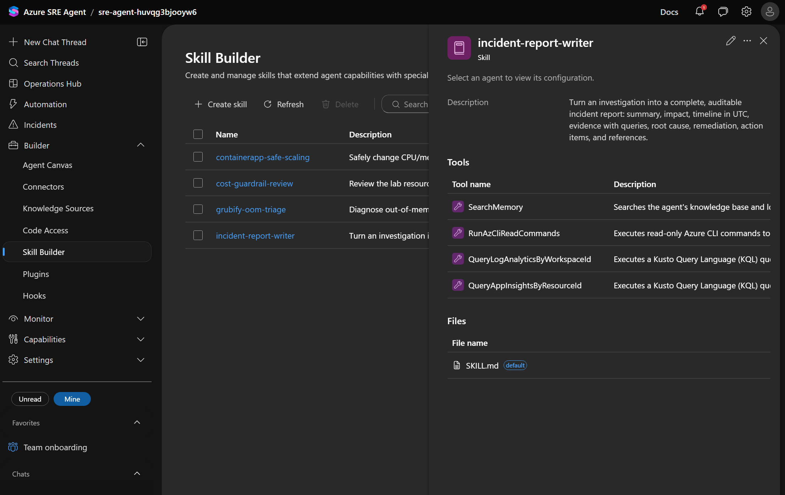
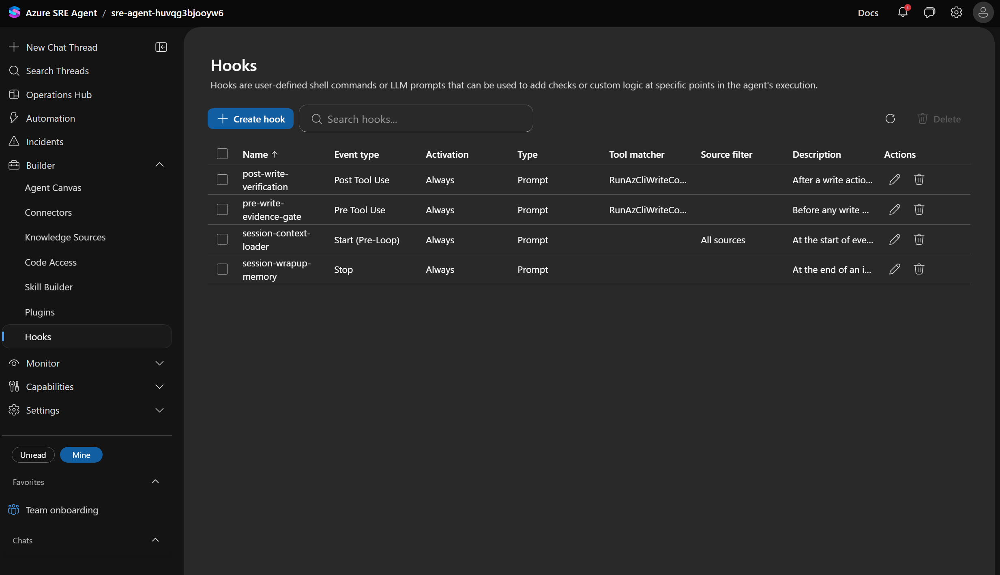
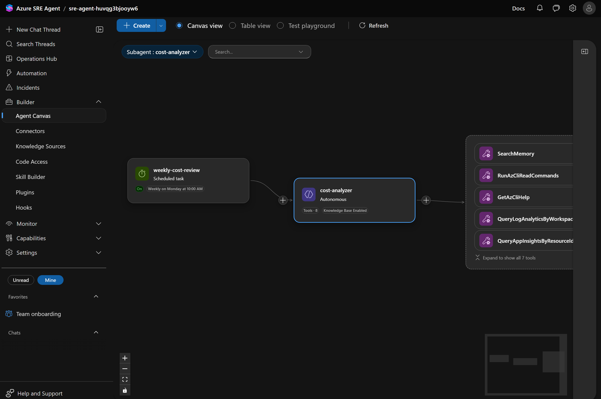
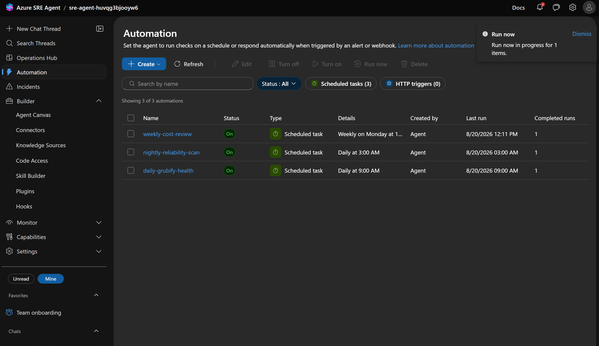

# 포털 기능 — SRE Agent 를 우리 조직 방식에 맞추기

Azure SRE Agent 는 배포 직후에도 인시던트를 조사하고 조치합니다.
[Lab 실습](../README.md)에서 보시는 것이 그 기본 동작입니다.

도입을 검토할 때 그다음에 나오는 질문은 대체로 세 가지입니다.

| 질문 | 답이 되는 기능 |
|---|---|
| **우리 팀 절차대로 움직이나요?**<br>확인 순서와 판단 기준은 조직마다 다릅니다. | Skills · Knowledge Sources |
| **함부로 고치지는 않나요?**<br>운영 환경에 쓰기 권한을 가진 자동화에 대한 당연한 우려입니다. | Hooks · Response Plans |
| **장애가 없는 날에는 무엇을 하나요?**<br>효과가 장애 시점에만 있다면 투자 근거가 약합니다. | Automation · Agent Canvas |

이 페이지는 그 세 질문을 **실제 에이전트에 설정하고 확인한 결과**입니다.
각 기능이 무엇을 해결하는지, 무엇을 넣었는지, 포털 어디에서 보이는지 순서대로 정리했습니다.
설정 파일과 적용 스크립트는 이 저장소의 [features-sre](.) 폴더에 그대로 들어 있어
**그대로 가져가 다른 환경에 적용**할 수 있습니다.

> 이 페이지의 포털 화면은 이 폴더의 설정을 **실제로 적용한 뒤 캡처한 화면**입니다.
> 같은 설정을 넣으면 본인 환경 [sre.azure.com](https://sre.azure.com) 에서도 동일하게 보입니다.

---

## 목차

1. [설정으로 바뀌는 범위](#1-설정으로-바뀌는-범위)
2. [각 기능이 해결하는 문제](#2-각-기능이-해결하는-문제)
3. [우리 환경에 적용하기](#3-우리-환경에-적용하기)
4. [외부 연동이 필요한 기능](#4-외부-연동이-필요한-기능)
5. [장애 상황에서 어떻게 맞물리나](#5-장애-상황에서-어떻게-맞물리나)
6. [직접 항목 추가하기](#6-직접-항목-추가하기)
7. [되돌리기](#7-되돌리기)
8. [부록 — 구성 파일과 API 레퍼런스](#8-부록--구성-파일과-api-레퍼런스)

---

## 1. 설정으로 바뀌는 범위

기본 배포 상태의 포털은 **인시던트 대응에 필요한 최소 구성만** 채워져 있습니다.
아래 "적용 후" 가 이 폴더의 설정을 넣었을 때 실제로 늘어난 항목 수입니다.

| 포털 섹션 | 기본 배포 | 적용 후 | 무엇이 추가되나 |
|---|:--:|:--:|---|
| **Skill Builder** | 0 | **4** | 장애 유형별 진단 · 조치 절차서 |
| **Hooks** | 0 | **4** | 조사 시작 · 쓰기 전 · 쓰기 후 · 종료 시점의 통제 규칙 |
| **Automation** | 0 | **3** | 장애가 없어도 도는 일 · 주 단위 점검 |
| **Agent Canvas** | 1 | **3** | 비용 분석 · 안정성 점검 담당 추가 |
| **Knowledge Sources** | 4 | **6** | SLO 기준, 에스컬레이션 정책 |
| **Response Plans** | 1 | **2** | 자동 조치 계획 + 사람 검토 계획 |
| Connectors · Code Access | 0 | 0 | GitHub 인증 필요 → [4장](#4-외부-연동이-필요한-기능) |

이 숫자는 추정이 아니라 **적용 후 포털에서 확인한 값**입니다 ([8.2](#82-적용-전--후)).

---

## 2. 각 기능이 해결하는 문제

### Skills — 팀의 런북을 에이전트가 읽게 만들기

장애 대응 절차는 보통 위키, 개인 메모, 담당자 머릿속에 흩어져 있습니다.
담당자가 바뀌면 그대로 사라집니다.

Skill 은 그 절차를 **에이전트가 조사 중에 꺼내 쓰는 형태**로 등록하는 기능입니다.
사람이 읽는 문서와 같은 내용을, 사람이 아니라 에이전트가 실행합니다.


<sup>적용 후 **Capabilities ▸ Skill Builder**. 오른쪽은 `incident-report-writer` 상세 —
에이전트가 쓸 도구 목록과 절차서 본문이 그대로 등록되어 있습니다.</sup>

이 Lab 에 넣은 4개는 다음과 같습니다.

| 스킬 | 하는 일 |
|---|---|
| `grubify-oom-triage` | OOM 진단 — 5xx 와 메모리 압박 상관 분석, 실패 컨트롤러 특정, 근거 기반 사이징 제안 |
| `containerapp-safe-scaling` | 안전한 스케일 변경 — CPU:메모리 허용 조합 검증, 적용, 리비전 확인, 롤백 절차 |
| `cost-guardrail-review` | 읽기 전용 비용 점검 — 과대 사이징, 유휴 리비전, Log Analytics 수집량 |
| `incident-report-writer` | 인시던트 리포트 작성 규칙 — UTC 타임라인, 재현 가능한 근거, 필수 섹션 |

> **도입 관점** — 한 번 등록한 절차는 담당자 교대와 무관하게 같은 품질로 실행됩니다.
> 개인 노하우가 조직 자산이 되는 지점입니다.

### Hooks — 권한을 줄이지 않고 행동을 제약하기

"AI 가 운영 환경을 직접 바꾼다" 에 대한 가장 흔한 반대 논거는 **통제 불가**입니다.
이때 선택지는 보통 두 가지로 보입니다 — 쓰기 권한을 아예 주지 않거나, 믿고 맡기거나.

Hook 은 세 번째 선택지입니다. 에이전트 실행 흐름의 특정 시점에 **조직의 규칙을 강제로 끼워 넣습니다.**
권한은 그대로 두고 행동에 조건을 겁니다.


<sup>적용 후 **Capabilities ▸ Hooks**. `Event type` 열이 훅이 끼어드는 시점이며,
`pre-write-evidence-gate` 는 쓰기 계열 도구에만 걸리도록 도구 matcher 가 지정되어 있습니다.</sup>

| 훅 | 시점 | 강제하는 규칙 |
|---|---|---|
| `session-context-loader` | 조사 시작 | 과거 인시던트를 먼저 검색하고 현재 baseline 을 확인할 것 |
| `pre-write-evidence-gate` | **쓰기 직전** | 근거 · 사이징 · 영향 범위 · 롤백 4가지를 제시할 것 |
| `post-write-verification` | 쓰기 직후 | 실제 검증 전까지 "완화됨" 이라고 말하지 말 것 |
| `session-wrapup-memory` | 종료 | 재사용 가능한 교훈을 팀 메모리에 남길 것 |

> **도입 관점** — `pre-write-evidence-gate` 가 이 Lab 의 핵심 논거입니다.
> 에이전트는 운영 환경 쓰기 권한을 **가지고 있는 상태**에서도 근거 없이 조치하지 못합니다.
> 권한 설계와 함께 보면 이해가 빠릅니다 →
> [권한 수준 선택 — Reader vs Privileged](../README.md#권한-수준-선택--reader기본값-vs-privileged)

### Agent Canvas — 역할과 권한을 나누기

하나의 에이전트가 모든 것을 하면 책임 범위와 권한 범위가 같이 넓어집니다.
Agent Canvas 는 역할별로 에이전트를 나누고 **각자에게 다른 도구와 권한**을 주는 화면입니다.


<sup>적용 후 **Builder ▸ Agent Canvas**. 트리거(예약 작업) → 담당 에이전트 → 도구가 한 줄로 이어집니다.
`cost-analyzer` 에는 읽기 도구만 연결되어 있습니다.</sup>

| 에이전트 | 역할 | 권한 |
|---|---|---|
| `incident-handler` *(기본)* | 장애 조사 및 완화 | 조사 + 제한적 쓰기 |
| `cost-analyzer` | FinOps 분석 — 우선순위가 매겨진 절감안 제시 | **읽기 전용** |
| `reliability-reviewer` | 사전 안정성 점검 — 다음 장애의 선행 지표 탐지 | **읽기 전용** |

> **도입 관점** — 조치가 필요 없는 역할에는 쓰기 권한을 주지 않습니다.
> 감사 · 컴플라이언스 검토에서 설명하기 쉬운 구조입니다.

### Automation — 장애가 없는 날에도 일하기

효과가 장애 시점에만 있으면 도입 근거를 만들기 어렵습니다.
Automation 은 정해진 주기로 에이전트를 돌려 **장애가 나기 전에 징후를 보고**하게 합니다.


<sup>적용 후 **Automation** 목록. 3개 작업이 모두 `On` 이며, 마지막 실행 시각과 실행 횟수를
이 화면에서 확인합니다.</sup>

| 작업 | 주기 | 담당 |
|---|---|---|
| `daily-grubify-health` | 매일 09:00 KST | `reliability-reviewer` |
| `nightly-reliability-scan` | 매일 03:00 KST | `reliability-reviewer` |
| `weekly-cost-review` | 매주 월 10:00 KST | `cost-analyzer` |

> 등록은 cron 으로 하며 **UTC 기준**입니다. KST 는 UTC+9 이므로 원하는 한국 시각에서 9시간을 뺍니다
> (예: 09:00 KST → `0 0 * * *`).

### Response Plans — 인시던트별로 자율 수준 정하기

모든 장애를 자동으로 조치하게 할 필요는 없습니다.
Response Plan 은 **어떤 인시던트를, 누가, 어느 수준까지** 처리할지 정하는 규칙입니다.

| 계획 | 대상 | 담당 | 모드 |
|---|---|---|---|
| `grubify-http-errors` | Sev0~Sev4 전체 | `incident-handler` | **Autonomous** — 조사 후 조치까지 |
| `grubify-latency-review` | 제목에 `latency` 포함, Sev2~Sev4 | `reliability-reviewer` | **Review** — 조사 후 사람에게 제안 |

> **도입 관점** — 처음에는 전부 Review 로 시작해, 신뢰가 쌓인 영역부터 Autonomous 로 옮기는 방식이
> 일반적입니다. 두 계획이 나란히 있으므로 포털에서 그 차이를 바로 비교할 수 있습니다.

### Knowledge Sources — "정상" 의 기준을 조직 언어로

에이전트가 "에러율 2%" 라고만 보고하면 그게 문제인지 아닌지는 여전히 사람이 판단해야 합니다.
판단 기준을 문서로 올려두면 에이전트가 **그 기준으로 결론까지** 냅니다.

| 문서 | 내용 |
|---|---|
| `grubify-slo.md` | SLO · 에러 예산 · RAG(정상/주의/위험) 판정 규칙 |
| `escalation-policy.md` | 자율 허용 범위, 사람 승인 필수 항목, 에스컬레이션 트리거 |

---

## 3. 우리 환경에 적용하기

Lab 이 배포되어 있어야 합니다 ([빠른 시작](../README.md#3-빠른-시작)).

```powershell
# 저장소 루트에서
pwsh -File features-sre/scripts/apply-features.ps1
```

엔드포인트는 azd 환경(`SRE_AGENT_ENDPOINT`)에서 자동으로 읽습니다. 직접 지정하려면:

```powershell
pwsh -File features-sre/scripts/apply-features.ps1 `
  -Endpoint https://<agent>--<id>.<region>.azuresre.ai
```

| 옵션 | 용도 |
|---|---|
| `-SkipKnowledge` | 지식 문서 업로드 건너뛰기 (재실행 시 인덱싱 시간 절약) |
| `-EnableGitHubConnector` | GitHub 커넥터 생성 — 이후 포털에서 **인증(Authorize)** 필요 |

**재실행해도 안전합니다.** 모든 항목은 이름 기준으로 생성 · 교체되며, 스케줄 작업은 동일 이름을
삭제 후 재생성합니다. 마지막에 각 섹션의 항목 수를 출력합니다.

```
Verification — what the portal will now show
   Knowledge Sources   6 item(s)  escalation-policy.md, grubify-slo.md, ...
   Skill Builder       4 item(s)  containerapp-safe-scaling, cost-guardrail-review, ...
   Hooks               4 item(s)  post-write-verification, pre-write-evidence-gate, ...
   Agent Canvas        3 item(s)  incident-handler, cost-analyzer, reliability-reviewer
   Automation          3 item(s)  daily-grubify-health, nightly-reliability-scan, ...
   Response plans      2 item(s)  Grubify HTTP Errors, Grubify Latency Degradation (Review mode)
```

적용 후 [sre.azure.com](https://sre.azure.com) 을 **새로고침**하세요.

---

## 4. 외부 연동이 필요한 기능

아래 세 가지는 외부 인증이나 외부 저장소가 필요해 스크립트만으로 끝나지 않습니다.
**포털에서 한 번 직접 승인**해야 합니다.

### Connectors (GitHub)

```powershell
pwsh -File features-sre/scripts/apply-features.ps1 -EnableGitHubConnector
```

생성 후 포털 **Builder ▸ Connectors** 에서 **Authorize** 를 눌러 GitHub OAuth 를 완료해야
연결됨 상태가 됩니다. 인증 전에는 목록에 보이되 미인증으로 표시됩니다.

### Code Access

GitHub 커넥터 인증이 **먼저** 완료되어야 합니다. 저장소를 연결하면 에이전트가
`파일:라인` 수준으로 근본 원인을 지목합니다 — 장애 원인이 인프라가 아니라 코드일 때 차이가 큽니다.

```bash
azd env set GITHUB_USER <your-github-username>
bash scripts/post-provision.sh --retry
```

### Plugins

플러그인은 **marketplace(플러그인 저장소)** 를 먼저 등록해야 목록이 채워집니다.
포털 **Builder ▸ Plugins ▸ Add marketplace** 에서 등록하거나 `Install from URL` 을 사용하세요.
등록된 marketplace 가 없으면 `No plugins available` 이 정상 상태입니다.

---

## 5. 장애 상황에서 어떻게 맞물리나

앞의 기능들은 따로 노는 설정이 아니라 **한 번의 장애 처리 안에서 순서대로 작동**합니다.

| 장애 처리 단계 | 작동하는 구성 |
|---|---|
| 장애 발생 | Response Plan 이 담당 에이전트와 자율 수준을 결정 |
| 조사 시작 | `session-context-loader` 훅이 과거 인시던트를 먼저 검색 |
| 원인 분석 | `grubify-oom-triage` 스킬의 진단 절차를 따름 |
| 조치 직전 | `pre-write-evidence-gate` 훅이 근거 4가지를 요구 |
| 조치 | `containerapp-safe-scaling` 스킬이 검증된 조합으로만 변경 |
| 조치 직후 | `post-write-verification` 훅이 실제 검증 전까지 완료 선언 금지 |
| 보고 | `incident-report-writer` 스킬 + `grubify-slo.md` 판단 기준 |
| 사후 | `session-wrapup-memory` 훅이 교훈을 팀 메모리에 저장 |
| 평시 | `daily-grubify-health` · `nightly-reliability-scan` 이 다음 장애를 예방 |

### 처음 보는 사람에게 설명하는 순서

1. **Operations Hub** — 지난 인시던트와 지표를 먼저 보여줌 (결과물부터)
2. **Agent Canvas** — 누가 무엇을 담당하는지
3. **Skill Builder** — `grubify-oom-triage` 를 열어 "에이전트가 읽는 런북" 확인
4. **Hooks** — `pre-write-evidence-gate` 로 통제 방식 설명
5. **Automation** — 장애가 없을 때도 도는 3개 작업
6. **Response Plans** — Autonomous 와 Review 비교
7. **장애 주입** — 앞의 1~6이 실제로 맞물리는 것을 시연

---

## 6. 직접 항목 추가하기

파일을 추가하고 스크립트를 다시 실행하면 됩니다. 스크립트가 각 폴더를 훑습니다.

### 스킬 추가

`skills/my-skill.json` + `skills/my-skill.md` 두 개를 만듭니다.

```json
{
  "name": "my-skill",
  "type": "Skill",
  "properties": {
    "description": "한 줄 설명 — 에이전트가 이 스킬을 언제 쓸지 판단하는 근거",
    "skillContentFile": "my-skill.md",
    "tools": ["RunAzCliReadCommands", "QueryLogAnalyticsByWorkspaceId"]
  }
}
```

### 훅 추가

```json
{
  "name": "my-hook",
  "type": "GlobalHook",
  "properties": {
    "eventType": "PreToolUse",
    "activationMode": "always",
    "description": "설명",
    "hook": { "type": "prompt", "matcher": "RunAzCliWriteCommands", "prompt": "...", "timeout": 60 }
  }
}
```

유효값 — `eventType`: `Start` · `Stop` · `PreToolUse` · `PostToolUse` /
`activationMode`: `always` · `onDemand` / `hook.type`: `prompt` · `command`

### 스케줄 작업 추가

`name` · `description` · `cronExpression` · `agentPrompt` · `agent` 가 모두 필수입니다.
`agent` 는 Agent Canvas 에 **실제 존재하는** 에이전트 이름이어야 합니다.

---

## 7. 되돌리기

Lab 리소스는 그대로 두고 이 폴더가 만든 항목만 제거하려면:

```powershell
$ep  = azd env get-value SRE_AGENT_ENDPOINT
$h   = @{ Authorization = "Bearer $(az account get-access-token --resource https://azuresre.dev --query accessToken -o tsv)" }

'containerapp-safe-scaling','cost-guardrail-review','grubify-oom-triage','incident-report-writer' |
  ForEach-Object { Invoke-WebRequest "$ep/api/v2/extendedAgent/skills/$_" -Headers $h -Method DELETE -SkipHttpErrorCheck }

'session-context-loader','pre-write-evidence-gate','post-write-verification','session-wrapup-memory' |
  ForEach-Object { Invoke-WebRequest "$ep/api/v2/extendedAgent/hooks/$_" -Headers $h -Method DELETE -SkipHttpErrorCheck }

'cost-analyzer','reliability-reviewer' |
  ForEach-Object { Invoke-WebRequest "$ep/api/v2/extendedAgent/agents/$_" -Headers $h -Method DELETE -SkipHttpErrorCheck }

Invoke-WebRequest "$ep/api/v1/incidentPlayground/filters/grubify-latency-review" -Headers $h -Method DELETE -SkipHttpErrorCheck
```

스케줄 작업은 ID 로 삭제합니다 — `GET /api/v1/scheduledtasks` 로 ID 를 확인한 뒤
`DELETE /api/v1/scheduledtasks/{id}`.

환경 전체를 삭제하려면 [README — 8. 정리](../README.md#8-정리-cleanup) 를 따르세요.

---

## 8. 부록 — 구성 파일과 API 레퍼런스

여기부터는 **직접 구성해 볼 분을 위한 내용**입니다.
이 폴더는 추측이 아니라 실제 에이전트에 적용 · 검증한 결과로 만들어졌습니다.

### 8.1 포털 섹션 ↔ 파일 매핑

| 포털 위치 | 이 폴더 | 사용하는 데이터플레인 API |
|---|---|---|
| Builder ▸ **Knowledge Sources** | [knowledge/](knowledge) | `POST /api/v1/AgentMemory/upload` |
| Builder ▸ **Skill Builder** | [skills/](skills) | `PUT /api/v2/extendedAgent/skills/{name}` |
| Builder ▸ **Hooks** | [hooks/](hooks) | `PUT /api/v2/extendedAgent/hooks/{name}` |
| Builder ▸ **Agent Canvas** | [agents/](agents) | `PUT /api/v2/extendedAgent/agents/{name}` |
| **Automation** | [automation/](automation) | `POST /api/v1/scheduledtasks` |
| **Incidents** ▸ Response plans | [response-plans/](response-plans) | `PUT · POST /api/v1/incidentPlayground/filters/{id}` |
| Builder ▸ **Connectors** | [connectors/](connectors) | `PUT /api/v2/extendedAgent/connectors/{name}` |

적용 대상과 스크립트:

| 항목 | 값 |
|---|---|
| 에이전트 | `sre-agent-huvqg3bjooyw6` (리소스 그룹 `rg-sre-lab`, eastus2) |
| 엔드포인트 | `https://<agent>--<id>.<region>.azuresre.ai` |
| 토큰 대상(resource) | `https://azuresre.dev` |
| 적용 스크립트 | [scripts/apply-features.ps1](scripts/apply-features.ps1) |

### 8.2 적용 전 → 후

| 포털 섹션 | 적용 전 | 적용 후 |
|---|:--:|---|
| Knowledge Sources | 4 | **6** — `grubify-slo.md`, `escalation-policy.md` 추가 |
| Response Plans | 1 | **2** — Review 모드 계획 추가 |
| Agent Canvas | 1 | **3** — `cost-analyzer`, `reliability-reviewer` 추가 |
| Skill Builder | **0** | **4** |
| Hooks | **0** | **4** (Start / PreToolUse / PostToolUse / Stop 각 1) |
| Automation | **0** | **3** |
| Connectors | 0 | 0 → *opt-in, [4장](#4-외부-연동이-필요한-기능) 참고* |
| Code Access | 0 | 0 → *GitHub 인증 후 가능* |
| Plugins | 0 | 0 → *marketplace 등록 필요* |

### 8.3 검증된 데이터플레인 스키마

포털 API 는 preview 이며 공개 문서가 없습니다. 아래 값은 **실제 요청/응답으로 확인**한 것입니다.
직접 항목을 추가할 때 이 값을 벗어나면 `ValidationFailure` 또는 `InvalidObjectType` 이 반환됩니다.

| 리소스 | 메서드 · 경로 | `type` | 필수 / 유효값 |
|---|---|---|---|
| Skill | `PUT /api/v2/extendedAgent/skills/{name}` | `Skill` | `properties.description`, `skillContent`, `tools[]` |
| Hook | `PUT /api/v2/extendedAgent/hooks/{name}` | `GlobalHook` | `eventType`: `Start` · `Stop` · `PreToolUse` · `PostToolUse`<br>`activationMode`: `always` · `onDemand`<br>`hook.type`: `prompt` · `command` (prompt 면 `hook.prompt` 필수) |
| Subagent | `PUT /api/v2/extendedAgent/agents/{name}` | `ExtendedAgent` | `instructions`, `handoffDescription`, `tools[]` |
| Scheduled task | `POST /api/v1/scheduledtasks` | — | `name`, `description`, `cronExpression`, `agentPrompt`, `agent` (모두 필수) |
| Response plan | `PUT` 신규 · `POST` 갱신 `/api/v1/incidentPlayground/filters/{id}` | — | `id`, `name`, `priorities[]`, `titleContains`, `handlingAgent`, `agentMode` |
| Knowledge file | `POST /api/v1/AgentMemory/upload` (multipart) | — | `files=@...`, `triggerIndexing=true` |
| Connector | `PUT /api/v2/extendedAgent/connectors/{name}` | `AgentConnector` | `dataConnectorType`, `dataSource` |

동작상 주의점 두 가지:

- **Skill / Hook / Subagent 의 PUT 은 비동기(202)** 입니다. 생성 직후 다른 리소스가 이를 참조하면
  실패할 수 있어, 적용 스크립트는 서브에이전트 생성 후 스케줄 작업 생성 전에 잠시 대기합니다.
- **Response plan 은 이미 존재하면 PUT 이 409** 를 반환하며 `Use POST to update` 를 안내합니다.
  스크립트는 409 를 받으면 자동으로 POST 로 재시도하므로 재실행해도 안전합니다.

> 이 API 는 문서화된 공개 API 가 아니므로 preview 기간 중 변경될 수 있습니다.

### 8.4 현재 상태만 확인하기

스크립트 실행 없이 지금 상태를 보려면:

```powershell
$ep = azd env get-value SRE_AGENT_ENDPOINT
$h  = @{ Authorization = "Bearer $(az account get-access-token --resource https://azuresre.dev --query accessToken -o tsv)" }

'/api/v1/AgentMemory/files',
'/api/v2/extendedAgent/skills',
'/api/v2/extendedAgent/hooks',
'/api/v2/extendedAgent/agents',
'/api/v1/scheduledtasks',
'/api/v1/incidentPlayground/filters' | ForEach-Object {
  $r = Invoke-RestMethod "$ep$_" -Headers $h
  $n = if ($r.value) { @($r.value).Count } elseif ($r.files) { @($r.files).Count } else { @($r).Count }
  "{0,-42} {1} item(s)" -f $_, $n
}
```

`apply-features.ps1` 도 마지막에 동일한 검증 결과를 출력합니다.

### 8.5 Operations Hub · Live Reports 는 왜 설정으로 못 채우나

이 두 화면은 설정이 아니라 **누적된 실행 결과**를 보여줍니다.
따라서 채우는 방법은 하나뿐입니다 — **인시던트를 한 번 실제로 발생시키는 것**입니다.

```bash
bash scripts/break-app.sh "<Grubify API URL>" 200 0.5
```

이 Lab 의 E2E 실행 이력이 남아 있어 Operations Hub 에는 인시던트 1건과 관련 지표가 표시됩니다.
시연 전에 한 번 더 실행하면 최신 데이터로 갱신됩니다 →
[README — 7. Lab 마무리와 반복 시연](../README.md#7-lab-마무리와-반복-시연)
