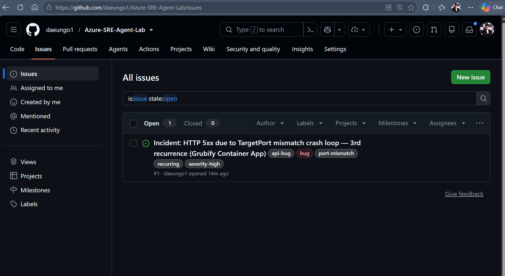

# 05. 채점 종합

세 시나리오를 **같은 기준으로 채점**한 결과입니다.
에이전트가 틀린 부분과 이 Lab 을 만들며 실패한 것도 함께 기록합니다.

- 실행: 2026-08-19 ~ 2026-08-20 · 리전 `eastus2` · 모드 **Autonomous**
- 대상: Azure Container Apps + Log Analytics + Application Insights

---

## 한눈에 보기

| 시나리오 | 근본 원인의 종류 | 장애 신호 | 탐지 | 인수 | 원인 도달 | 자율 조치 | 점수 | 판정 |
|---|---|---|--:|--:|--:|---|--:|---|
| [S1](02-scenario-s1.md) 메모리 누수 → OOM | 코드 · 리소스 한계 | HTTP 5xx 급증 | 3분 | 54초 | 4분 25초 | 재시작 + 1Gi→2Gi | **10/10** | ✅ Pass |
| [S2](03-scenario-s2.md) 인그레스 포트 불일치 | 배포 설정 오류 | 전 요청 503 | 2분 52초 | 49초 | **80초** | targetPort 9090→8080 | **8/10** | ✅ Pass |
| [S3](04-scenario-s3.md) 주문 API 지연 | 애플리케이션 설정 | 오류 없이 4초 지연 | 3분 44초 | 69초 | 4분 49초 | ⚠️ 계획만, 미실행 | **8/10** | ✅ Pass |

**종합 판정 — ✅ 성공**

- 세 시나리오 모두 Pass
- 탐지 지연 **2분 52초 ~ 3분 44초**
- 경고 → 조사 인수 **49 ~ 69초**
- 자율 조치 성공 **2/3** — S3 는 계획까지만 도달하고 쓰기가 완료되지 않음
- 승인 없는 위험 조치 **0건** (모든 쓰기 전 `pre-write-evidence-gate` 훅 통과)

---

## 이 Lab 이 실제로 증명한 것

### 1. 증상이 아니라 원인을 본다

S1 과 S2 는 **똑같이 HTTP 5xx** 입니다. 그런데 S2 조사에서 에이전트는 이렇게 적었습니다.

> *"Root cause identified: Port mismatch, **NOT OOM this time**. … different root cause than previous incidents."*

과거 인시던트가 팀 메모리에 있는데도 **거기에 끌려가지 않았습니다.**

### 2. 오류가 없어도 장애로 인식한다

S3 는 5xx 가 **하나도** 없습니다. 전부 200 이고 느리기만 합니다.
"에러 없으니 정상" 으로 끝내지 않고 `ORDER_DELAY_MS=4000` 이라는 **설정값 하나**까지 좁혔습니다.

### 3. 막히면 우회하고, 막힌 사실을 보고한다

| 막힌 것 | 에이전트의 행동 |
|---|---|
| `AppRequests` 테이블이 비어 있음 | *"returned zero rows — need to sanity-check the data sources"* 라고 말한 뒤 Container Apps 진단 도구로 전환 |
| ACR 접근 권한 없음 | 이미지 내용 확인을 포기하고 **환경 변수 쪽으로 경로 변경** |
| 소스에서 `ORDER_DELAY_MS` 미발견 | 코드 대신 리비전·이미지 태그 비교로 결론 도달 |

### 4. 조치 주체가 검증된다

"사람 개입 0회" 는 자기 보고가 아니라 **Azure 활동 로그**로 확인했습니다.

```text
05:49:02Z  containerApps/write  admin@MngEnvMCAP359144...      ← 사람(장애 주입)
05:54:53Z  containerApps/write  25b6a2dc-...(관리 ID)          ← 에이전트(자율 복구)
```

---

## 에이전트가 틀린 것

정확도만 적으면 자료가 아니라 홍보물이 됩니다. 감점 사유를 그대로 남깁니다.

| 시나리오 | 잘못된 주장 | 영향 |
|---|---|---|
| S2 | 인과를 **뒤집어** 서술 — "새 리비전이 앱 포트를 바꿨다" (실제로는 인그레스가 바뀜) | 조치는 정확, 서사는 오류 → 불확실성 **-1** |
| S3 | 소스에서 `ORDER_DELAY_MS` 를 못 찾자 *"코드에 없고 이미지에만 있다"* 고 단정 | 실제로는 **커밋됐지만 복제본이 오래됨** → 불확실성 **-1** |
| S3 | 롤백을 선언하고 훅까지 통과했으나 **쓰기가 완료되지 않음** | 앱에 지연이 남아 사람이 복구 → 완화 **-1** |

감점은 대부분 **"확인하지 못한 것을 확인했다고 말한 것"** 입니다.
반면 **근본 원인 판단은 세 시나리오 모두 정확**했습니다.

---

## 이 Lab 을 만들며 실패한 것

### S2 를 만들며 — 첫 주입이 동작하지 않음

| 시도 | 결과 |
|---|---|
| `ASPNETCORE_URLS=http://+:9090` 으로 변경 | ❌ 앱이 그대로 8080 바인딩 — 레플리카 정상, HTTP 200 |
| 인그레스 `targetPort` 를 9090 으로 변경 | ✅ 전 요청 503 |

그리고 **실패한 시도가 남긴 리비전 이력이 S2 의 오판을 유발**했습니다.
장애 주입 Lab 에서 *증거 위생(evidence hygiene)* 이 필요한 이유입니다.

### S3 를 만들며 — CPU 를 굶겨도 느려지지 않음

처음에는 CPU 를 `1.0 → 0.25` 로 줄이고 스케일아웃을 막아 지연을 만들려 했습니다.

| 구간 | 요청량(분당) | 서버 응답시간 |
|---|--:|--:|
| 정상 (CPU 1.0) | 120 | 1~3 ms |
| CPU 1/4 + 스케일아웃 차단 | **518 ~ 633** | **0 ~ 0.5 ms** |

트래픽은 분당 600건 넘게 도달했는데 응답 시간이 그대로였습니다.
`GET /api/fooditems` 가 **메모리에서 정적 목록만 반환**해서 병목이 생기지 않습니다.

→ 결국 fork 한 앱에 **`ORDER_DELAY_MS` 미들웨어를 추가**해서 해결했습니다
([04-scenario-s3.md](04-scenario-s3.md#앱에-지연-주입-지점-만들기)).

### 에이전트가 업스트림 저장소에 이슈를 만든 건

**증상** — 조사 결과가 원본 저장소 `dm-chelupati/grubify` 에 이슈로 등록됐습니다(#321, #322).
사용자의 fork 가 아니라 **남의 저장소**입니다.

**원인 두 가지**

| # | 원인 | 확인 방법 |
|:--:|---|---|
| 1 | `knowledge-base/grubify-architecture.md` 가 저장소를 **하드코딩** | Knowledge Base 에 색인된 문서라 에이전트가 정답으로 신뢰 |
| 2 | `GITHUB_USER` 미설정 → 예약 작업이 **업스트림을 기본값**으로 사용 | `azd env get-value GITHUB_USER` → key not found |

Code Access 에는 fork 가 정상 연결돼 있었습니다.
**코드를 읽는 대상과 이슈를 쓰는 대상이 서로 달랐던 것**이 핵심입니다.

덧붙여 조사 로그를 보면 내장 GitHub 도구는 인증에 실패했고
(*"GitHub issue creation failed due to auth"*), 에이전트가 `gh api` 로 **우회해서 성공**했습니다.
즉 **권한이 아니라 지식이 잘못된 대상을 가리킨 문제**였습니다.

**조치 — 읽는 저장소와 쓰는 저장소를 분리**

```bash
azd env set GITHUB_ISSUE_REPO daeungo1/Azure-SRE-Agent-Lab   # 이슈가 쌓일 곳
azd env set GITHUB_REPO       daeungo1/grubify               # 코드를 읽을 곳
```

- 지식 베이스에서 저장소 하드코딩 제거, 실행 환경 값은 `lab-environment.md` 로 **배포 시점에 렌더링**해 색인
- 서브에이전트 지시문에 *"오직 `GITHUB_ISSUE_REPO` 에만 쓸 것. 코드 읽기는 허용"* 명시
- `post-provision.sh` 가 `GITHUB_REPO` 없이 예약 작업을 만들지 않도록 변경
- `yaml-to-api-json.py` 가 빈 값·업스트림 저장소를 받으면 **오류로 중단**

**재검증 (2026-08-20)** — S2 포트 불일치를 다시 주입한 결과, 에이전트는 07:31 에 자동 복구하고
이슈를 **`daeungo1/Azure-SRE-Agent-Lab#1`** 에 등록했습니다. 업스트림에는 신규 이슈가 없습니다.

<p align="center">
  
</p>

> **교훈** — 에이전트에 쓰기 권한이 있는 외부 시스템은 **권한만 좁혀서는 부족**합니다.
> 에이전트가 참조하는 문서가 잘못된 대상을 가리키면 그대로 따라갑니다.

---

## 운영 권고

1. **Review 모드로 시작**하고, 정확도가 쌓인 유형만 Autonomous 로 옮깁니다.
2. **시나리오(경고 규칙)마다 별도 규칙**을 둡니다. 재조사 쿨다운이 규칙 단위라 조사가 병합됩니다.
3. **Code Access 의 동기화 시점**을 확인하세요. 배포한 코드와 에이전트가 읽는 코드가 다르면
   원인을 찾아도 근거를 채우지 못합니다 (S3 에서 실제 발생).
4. 외부 시스템 대상은 **지식 베이스에 이름으로 고정**하세요.
5. 장애 주입 후에는 **반드시 복구**하고 다음 시나리오로 넘어가세요. 남은 흔적이 다음 조사를 오염시킵니다.

---

## 비용

| 항목 | 값 |
|---|---|
| 조사 1건당 활성 비용 | 약 **35 AAU** (Claude Opus 기준 · [문서값](https://learn.microsoft.com/azure/sre-agent/pricing-billing)) |
| 이 Lab 에서 실행한 조사 | 4건 (S1 1건 · S2 2건 · S3 1건) |
| 상시 비용 | **4 AAU/시간** — 에이전트를 **삭제**해야 멈춥니다 |

---

## 시나리오 다시 보기

[S1 메모리 누수](02-scenario-s1.md) · [S2 포트 불일치](03-scenario-s2.md) · [S3 응답 지연](04-scenario-s3.md)
